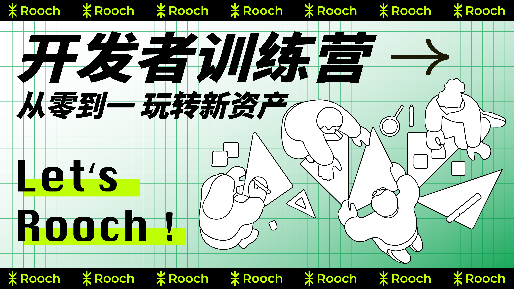

  <h1>Let's Rooch Bootcamp</h1>

 
Let's Rooch Bootcamp 的目标是构建一个学习社区, 引导新入门或者未入门的 Bitcoin 开发 & Move 编程的小伙伴一起探索 Web3 宇宙。

 

    
    
    
    
  

## 训练营简介

在当前快速发展的区块链行业中，Bitcoin 作为第一代加密货币，依然保持着重要的地位和影响力。作为首个成功实现去中心化数字货币的区块链，Bitcoin 为整个行业奠定了基石。然而，随着时间的推移，Bitcoin 网络在处理性能、扩展性等方面面临着一些挑战，这就为 Rooch 的出现带来了机遇。

Rooch Network 是 Bitcoin 的原生应用层，基于堆叠式 L2 解决方案，为用户和开发者提供比特币资产的启动平台和比特币应用基础设施，为 Bitcoin 带来了全新的可能性。Rooch Network 利用 Move 编程语言，在 Bitcoin 的基础上构建出一个可编程的区块链平台。这不仅提升了 Bitcoin 的性能和可扩展性，也为开发者们带来了全新的机会。即，一方面 Rooch Network 继承了 Bitcoin 的安全性和去中心化特性，另一方面引入了 Move 语言的高效性和可编程性。这使得开发者可以在 Rooch 上快速构建出各种去中心化应用(涵盖金融、游戏、社交等多个领域），还提供了与原生 Bitcoin 的紧密集成，使得应用可以无缝地与 Bitcoin 网络互操作，为 Bitcoin 生态注入了新的活力。

无论是熟悉 Bitcoin 的老手，还是对区块链技术感兴趣的新手，Rooch Network 都是值得关注和了解的重要项目。Rooch 期待与各位 一起在 Web3 世界带来的精彩变革！

## 课程安排

Rooch 开发者训练营正式开启报名，具体课程为期 6 周，第一堂课的时间会随后公布。通过课程，开发者将了解 Rooch Network 的基本概念和原理，掌握 Rooch 的 Bitcoin 扩展方案，在实战中学会使用 Rooch 开发 Web3 应用。课程安排如下：

### 课程形式

- 腾讯会议 在线直播
- 录播视频，剪辑上传视频平台后，链接放 [Videos](./videos.md) 页面

### 导师简介

- Jolestar
  - Rooch 创始人，MoveFunsDAO 发起人，Bitseed & Movescription 协议作者。曾任 WestarLabs 首席架构师，青云容器平台负责人，新浪微博架构师，互联网从业经验 10 多年，2017 年后专注于区块链基础设施领域，致力于 Web3 的广泛采用
- Haichao
  - Rooch Network 项目的联合创始人兼 CEO，曾在 Nervos，Solana，Algorand 和 Aptos 等公链项目工作。在此之前，Haichao 曾在微软亚洲研究院，德国 Hasso-Plattner-Institut 和东京大学进行学术研究工作
- Baichuan
  - Rooch 核心开发者，区块链技术爱好者，10+ 年开发经验，先后在新浪微博/映客/WestarLabs 做架构设计和技术开发，21 年开始专注在区块链行业，开发公链和建设生态基础设施。
- Sven
  - 连续创业者，曾任互联网从业经验 10 多年，2021 年后专注于区块链基础设施领域，致力于 Web3 的广泛采用
- MX
  - 区块链从业者，Move 语言布道者，21 年后专注于区块链领域，具备多链开发经验，致力于 Web3 的广泛采用

### 课程大纲

**一、Bitcoin 基础知识以及课程介绍**

- 讲师：Haichao
- 时间：2024年7月10日
- 视频：[腾讯会议录制](https://meeting.tencent.com/user-center/shared-record-info?id=8ed2b5d7-53ae-4413-abd8-a1fc90ea8d6a&from=3&record_type=2) 提取密码：Q6M4
- 资料：[PPT](https://docs.google.com/presentation/d/1IGCnAhAFjoI_Nk5CzTIAjN0CgDYhaUqW1mYXvlvsgS8/edit?usp=sharing)

**二、Move 基础知识以及入门**

- 讲师：Bai Chuan
- 时间：2024年7月17日
- 视频：[腾讯会议录制](https://meeting.tencent.com/v2/cloud-record/share?id=d17e2e11-a36c-481e-98bf-a5f6b73c8ddd&from=3&is-single=false&record_type=2) 提取密码：2S1O
- 资料：[PPT](https://docs.google.com/presentation/d/1LQCSmpEArqkcYcXU3C4P-n-6DK-LLsHBaWMluMksCGg)

**三、Rooch 介绍以及开发入门**

- 讲师：Jolestar

- 时间：2024年7月24日

**四、Rooch Move 框架和功能介绍**

- 讲师：MX
- 时间：2024年7月30日

**五、Rooch DApp 以及 SDK 开发**

- 讲师：Sven
- 时间：2024年7月31日

**六、黑客松**

- 为期十天

期待你在 Rooch Network 生根发芽！

## Bounty

- 每上完一堂课 完成作业 记录 50 分
- 每堂课前 3 名提交 各记录 10 分（顺序确定方式：完成作业后，在微信群 @JoeChen，合并当周的作业 PR，以此确定提交顺序）
- 每堂课前 3 名优秀作业 各记录 10 分（由导师们确定优秀作业）
- 黑客松提交 Demo 100 分
- 优秀 Demo：第一名 1000 分；第二名 800 分；第三名 600 分；第四名 400 分；第五名 200 分
- 最终分值累计第一名奖励一台 iPhone（如果并列第一，学员投票）
- 所有学员分值将公开记录，按学员实际分值瓜分 $100,000 Rooch

### 计分公示

每周统计一次得分，公示在 [Scoring](./scoring.md) 中。

## 结业仪式

- 时间：2024年8月10日

线上公布分值，颁发奖品

## 如何参与

1. 填写 Rooch 开发者训练营报名表单，加入 Rooch 星航计划微信群组，即为报名成功。
2. Fork 本仓库，**复制** [members/githubid](./members/githubid) 目录名为 `members/$your_github_id`，根据自己的信息编辑其中的 `readme.md` 内容，并提交 **Pull Request** 给本仓库，持续跟踪学习进度。（例如Joe Chen `fork` 一份，并重命名为 `geometryolife` 这个文件目录）
3. 学习过程中可以持续更新该文件的学习日志，以及学习成果。如果学习过程中问题，可以在群里讨论。如果需要一些练习任务，但又找不到合适的，可以咨询导师。
