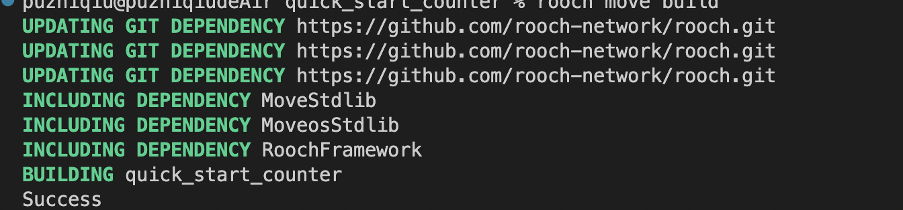
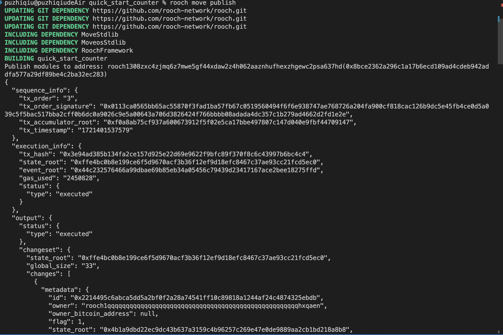

# 学习成果
### 第一次作业（调研比特币生态项目）
##### Babylon
* [项目官网链接](https://babylonchain.io/learn)
* 大饼质押协议，简单理解为大饼版本的Eigenlayer
* **参与方式** 测试网质押给先锋NFT


##### QED
* [项目官网链接](https://www.rootdata.com/zh/Projects/detail/QED%20Protocol?k=OTE3MQ%3D%3D)

* **简介** 比特币扩容黑科技，专注零知识证明。融资超1000万美元，Blockchain Capital、Starkware等大佬力挺。测试网即将在3-4个月内上线，原生代币同步亮相，QED是比特币的zk原生执行层，旨在应对Web3开发的挑战。这个横向可扩展、安全且用户友好的平台是为开发者和用户构建的，支持从DeFi到NFT等广泛的应用程序。基于 QED 构建的去中心化应用程序可以在本地证明交易，为用户提供固定 Gas 费用的无限计算。这种创新方法确保每个用户的公钥都充当自定义 ZK 电路，具有可从状态读取的“智能签名”，类似于智能合约。


##### BitVM
* [项目官网链接](https://bitvm.org/）
* **简介** BitVM 实现了第二层的自由市场，有可能将比特币扩展到数十亿用户。BitVM 是一种表达图灵完备比特币合约的计算范式。这不需要更改网络的共识规则。它们不是在比特币上执行计算，而是仅进行验证，类似于乐观汇总。证明者声称给定函数会针对某些特定输入评估某些特定输出。如果该声明是错误的，任何人都可以执行欺诈证明并惩罚证明者。使用这种机制，可以在比特币上验证任何可计算函数。BitVM 是连接 BTC 和侧链、rollups 和zkCoins等第二层的基础元素。

##### Bitcoin L2
* [项目官网链接](https://www.nakamoto.run/）
* **目的** Nakamoto 是 Stacks 层即将进行的一项重大升级，旨在使其更快、更安全。
* **目前发展** Bitwave实验室创始人RLhodl和团队成员已经初步完成了Bitcoin L2的开发，并在全球BTC算力矿池分布式部署了4200个测试节点。据悉，该项目由Meta Dao领投，Web3 Ventures、KN Capital、M DAO、CryptoSeed Fund和AN Innovators Capital等机构参投。 目前，Bitwave进入了测试的第二阶段，正式向全球社区开放招募节点测试

##### LST 协议 StakeStone
* **主要解决什么问题** 
1.流动性与收益的平衡：传统质押通常会导致资产流动性的丧失，因为质押的资产被锁定，无法在其他地方使用。StakeStone 通过提供 Yield-bearing ETH（生息以太坊）的概念，允许用户在获得质押收益的同时，保留资产的流动性2.跨链兼容性：随着多链生态系统的发展，用户需要在不同的区块链之间高效地移动和管理资产。StakeStone 通过建立基于 STONE 的多链流动性市场，支持资产和价格在多个区块链之间的无缝转移。
3.自动收益优化：用户可能缺乏专业知识或时间来不断优化他们的质押策略。StakeStone 的 OPAP（Optimising Portfolio and Allocation Proposal）机制自动调整底层资产配置，确保用户能够获得最优的质押收益。
4.透明度和安全性：在 DeFi 领域，底层资产的透明度和安全性至关重要。StakeStone 通过去中心化的架构和非托管的服务，提供了完全的资产和收益透明度，确保用户资金的安全。
5.简化集成和采用：对于 Layer 2 开发者来说，集成流动性质押解决方案可能会带来额外的复杂性。STONE 作为基于 LayerZero 的非 rebase OFT（Omnichain Fungible Token），可以轻松地被 Layer 2 开发者集成，无需额外的复杂性。

* **核心功能**
1.流动性质押：用户可以将 ETH 或其他支持的资产质押到 StakeStone 中，以获得质押收益。这些资产被转换为 Yield-bearing ETH 或其他形式的 LST，这些代币代表了用户的质押资产和相应的收益权。
2.多链兼容性：STONE 是基于 LayerZero 构建的，这意味着它可以在多个区块链之间无缝转移，为用户提供跨链流动性的解决方案。
3.自动收益优化：通过 OPAP（Optimising Portfolio and Allocation Proposal）机制，StakeStone 能够自动调整和优化底层资产的配置，以确保用户获得最佳的质押收益。
4.非托管和透明性：StakeStone 的架构是非托管的，所有交易和资产状态都是公开可验证的，确保了用户对其资产的完全控制和透明度。
5.易于集成：对于 Layer 2 开发者而言，STONE 可以轻松集成到他们的平台中，无需复杂的设置或额外的技术要求。
* **运作原理**
1.质押与转换：用户将 ETH 或其他资产发送到 StakeStone 协议中，这些资产随后被转换为相应的 LST（如 STONE 代币），这些代币可以在其他 DeFi 平台或应用中使用，同时用户获得质押收益。
2.OPAP 机制：OPAP 是 StakeStone 的一个创新特性，它允许协议根据市场条件和策略性能自动调整其资产配置。这意味着 STONE 持有者可以自动获得最优的质押收益，无需手动管理。
3.跨链流动性：STONE 作为基于 LayerZero 的 OFT，支持跨链流动性，使得资产可以在不同的区块链网络之间自由移动，为用户提供更广泛的市场机会。
4.收益分配：质押收益（包括交易费、治理奖励等）会定期分配给 STONE 持有者，这些收益可以是直接的代币分配，也可以是以增加的 STONE 价值的形式体现。
* **核心优势**
1.收益最大化：通过 OPAP 机制，StakeStone 能够确保用户获得最大化的质押收益，而无需用户自己进行复杂的资产管理。
2.安全性和信任：由于其非托管的特性和透明度，用户可以完全信任系统，并且可以实时追踪自己的资产和收益情况。
3.跨链能力：STONE 代币的跨链能力为用户提供了更广泛的投资机会，使他们能够利用不同区块链网络的优势。
4.易于集成：对于 Layer 2 开发者而言，STONE 的易于集成性降低了技术门槛，使得更多的项目可以快速采用 StakeStone 的流动性质押服务。
5.用户体验：StakeStone 的设计注重用户体验，通过简化的操作流程和直观的界面，使得即使是 DeFi 新手也能够轻松参与。
***


### 第二次作业
```move
module quick_start_counter::quick_start_counter {
    use moveos_std::account;
    struct Counter has key {
        count_value: u64
    }
    fun init() {
        let signer = moveos_std::signer::module_signer<Counter>();
        account::move_resource_to(&signer, Counter { count_value: 0 });
    }
    entry fun increase() {
        let counter = account::borrow_mut_resource<Counter>(@quick_start_counter);
        counter.count_value = counter.count_value + 1;
    }
}
```
### 成功build截图



### 成功在dev环境部署成功截图

***
### 第三次作业

#### 利用Rooch 提供的特性，构思一个游戏

##### 游戏名称 ：CryptoLand
##### 游戏简介： CryptoLand是一个虚拟世界建造与探索游戏，玩家可以在游戏中拥有土地、建筑、道具和角色，这些资产都是基于Bitcoin和Rooch Network的数字资产。CryptoLand利用Rooch Network的VApp容器和分布式状态树协议，提供一个完全去中心化且具有高可扩展性的游戏体验。

##### 核心玩法：
###### 土地所有权与建造：
玩家可以在Bitcoin L1上购买土地，土地的所有权通过Ordinals协议在L1上记录。
在Rooch Network的L2层，玩家可以在他们拥有的土地上建造建筑物，如房屋、商店、农场等，所有权绑定到L1上的土地资产。
建筑物的所有权和状态在L2层管理，玩家可以自由交易和转让。
###### 资源采集与交易：
玩家可以在土地上采集各种资源，如木材、矿石、农产品等，这些资源是L2层的衍生资产。
资源可以在游戏内市场上交易，市场交易通过Rooch提供的智能合约进行结算，并可以利用Bitcoin L1资产进行支付。
###### 角色与道具：
玩家可以创建和自定义角色，角色在L2层拥有独特的身份标志（如特定的Ordinals资产）。
角色可以装备各种道具，这些道具是NFT形式的数字资产，可以在游戏内获得或交易。
###### 任务与冒险：
游戏内设有各种任务和冒险活动，玩家可以组队探索未知区域，完成任务获得奖励。
任务奖励包括稀有资源、特殊道具和角色升级，奖励通过Rooch Network的智能合约分发。
###### 社区与治理：
玩家可以组成社区，共同拥有和管理土地，甚至创建自己的小型自治组织（DAO）。
社区可以通过投票治理，利用L1上的资产进行投票，使得治理过程透明且去中心化。

###### 内置市场：
玩家可以在游戏内市场买卖土地、建筑、资源和道具。
市场交易通过Rooch Network的智能合约执行，支持Bitcoin L1资产结算。
###### 奖励与激励：
通过完成任务和参与社区活动，玩家可以获得游戏内的奖励，包含虚拟货币和稀有资产。同时在地上面的产物也可以时刻生成奖励代币