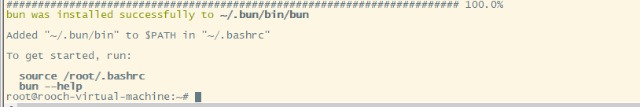
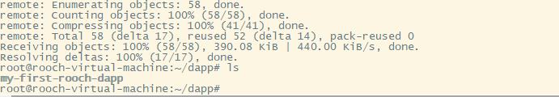
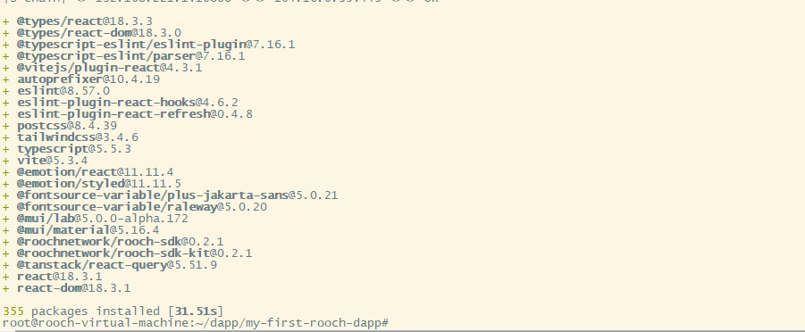
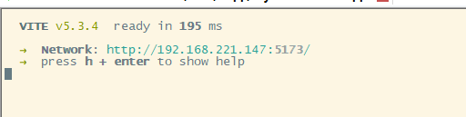
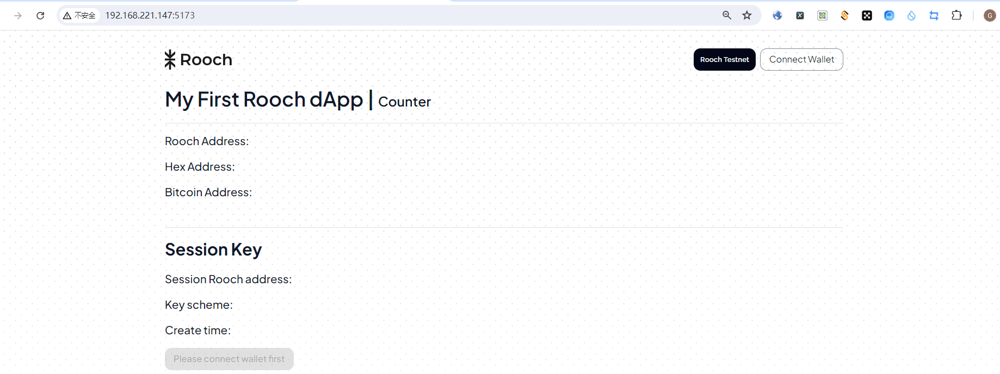
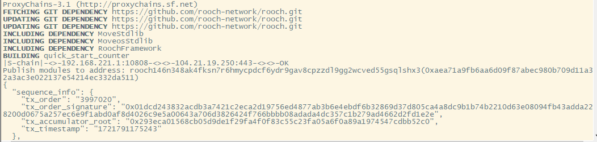
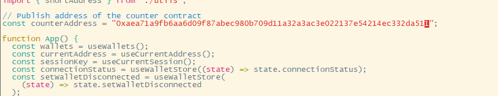
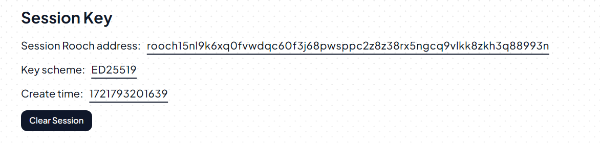
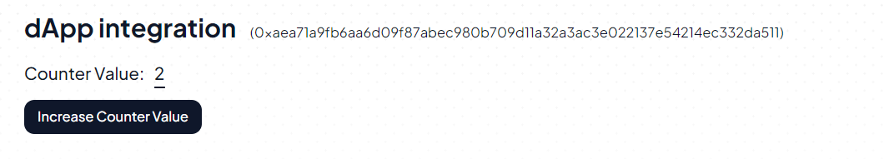

##安装bun：
curl -fsSL https://bun.sh/install | bash

##配置bun环境变量：
PATH=/root/.bun/bin/:$PATH

##下载dapp源码：
git clone https://github.com/rooch-network/my-first-rooch-dapp.git

##安装依赖:
bun install

##启动dapp:bun dev --host 192.168.221.147

##访问192.168.221.147:5173

##发布合约程序：
rooch move publish --named-addresses quick_start_counter=default

##将发布程序地址添加到：src/App.tsx

##浏览器连接钱包：

##创建session

##调用increase Counter Value
