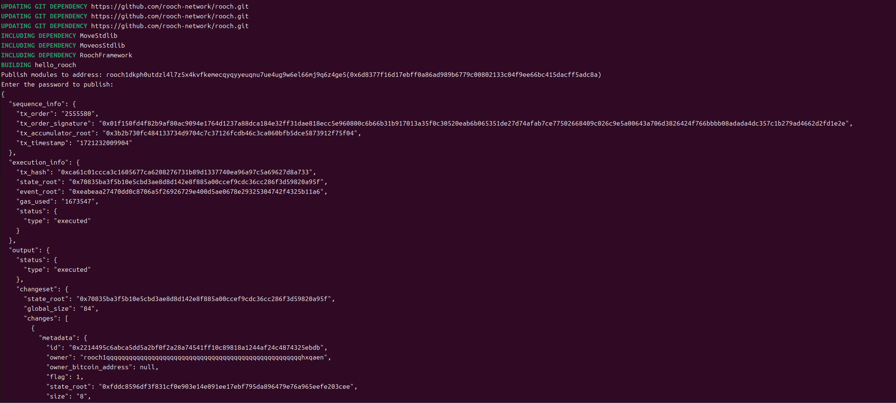
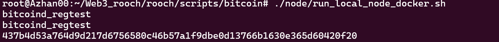
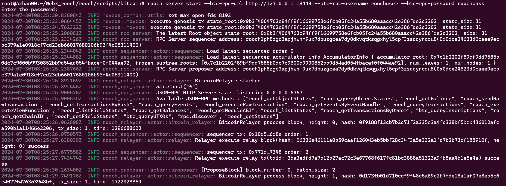
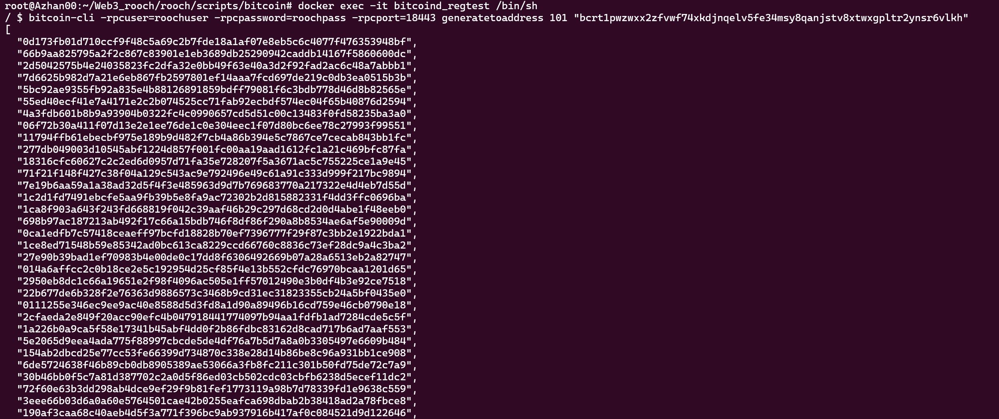
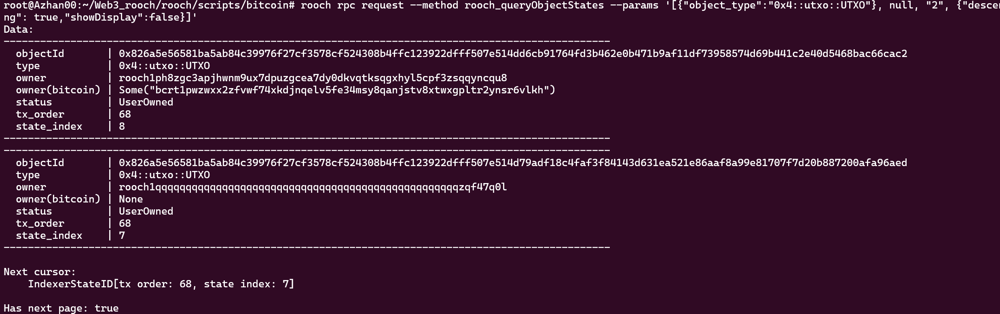
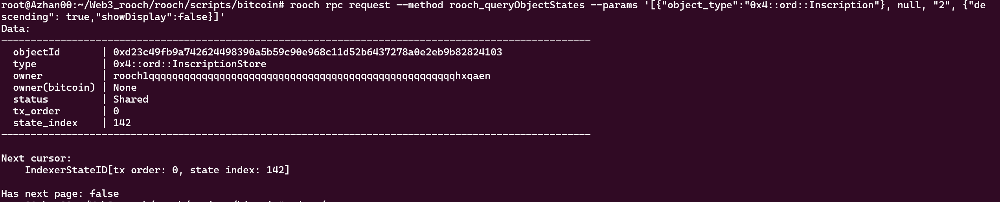
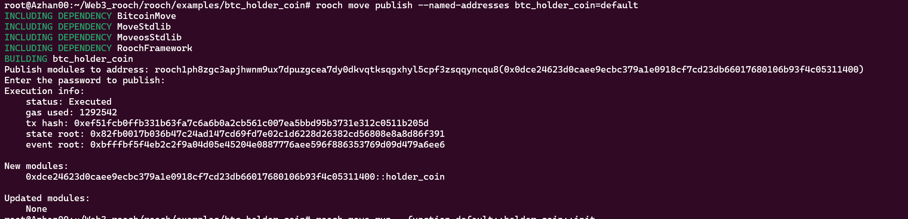
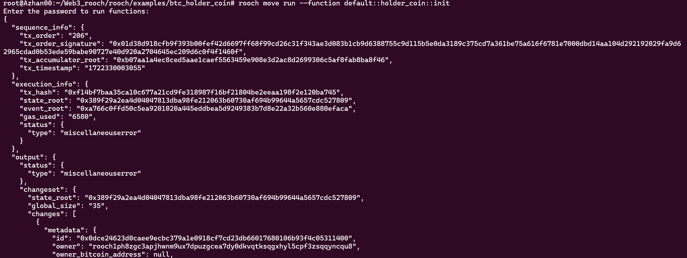
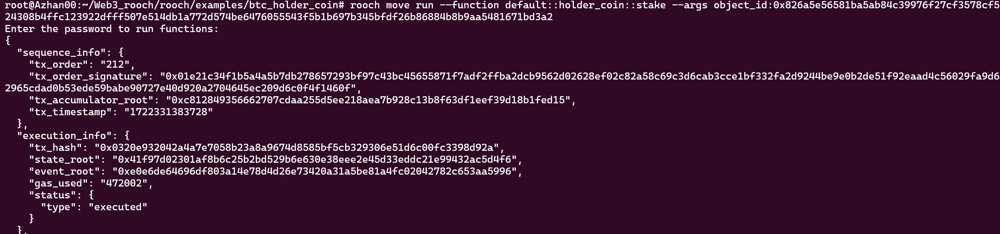

# 学习日志

## task01

本机是**Windows**环境的，但是考虑到后续win系统的开发不便，就先利用docker环境，进行节点同步

- docker里搜索：lncm/bitcoind
- pull之后在run
- 等待同步，查看height
- 

## tesk02

采用的是虚拟机中ubuntu环境

默认rooch安装完成

- 先进行创建账户，输入`rooch init`完成一些自定义设置好后

- 输入`rooch env list`,检查当前所在网络，我选择的是在测试网（testnet），`rooch env switch --alias test`该命令用于激活测试网，激活好后，在次输入`rooch env list`进行检查

- 领取gas，在`https://discord.gg/rooch`领取，你的地址可以用`rooch account list`查看

- `rooch account balance --address 地址`可查看gas

- 创建合约`rooch move new hello_rooch`

- 在sources目录下创建hello_rooch.move文件

  ~~~move
  module hello_rooch::hello_rooch {
      use moveos_std::account;
      use std::string;
  
      struct HelloMessage has key {
          text: string::String
      }
  
      entry fun say_hello(owner: &signer) {
          let hello = HelloMessage { text: string::utf8(b"Hello Rooch!") };
          account::move_resource_to(owner, hello);
      }
  }
  ~~~

- 编译：`rooch move build`
- 部署：`rooch move publish`

结果图：

## task03

- 先运行``./node/run_local_node_docker.sh`

  

- `rooch server start --btc-rpc-url http://127.0.0.1:18443 --btc-rpc-username roochuser --btc-rpc-password roochpass`启动服务

  

- 使用docker生成的区块
- `bitcoin-cli -rpcuser=roochuser -rpcpassword=roochpass -rpcport=18443 generatetoaddress 101 "bcrt1pwzwxx2zfvwf74xkdjnqelv5fe34msy8qanjstv8xtwxgpltr2ynsr6vlkh"`

  

- 运行 `rooch rpc request --method rooch_queryObjectStates --params '[{"object_type":"0x4::utxo::UTXO"}, null, "2", {"descending": true,"showDisplay":false}]'` 以查询 UTXO 集合

  

- 运行 `rooch rpc request --method rooch_queryObjectStates --params '[{"object_type":"0x4::ord::Inscription"}, null, "2", {"descending": true,"showDisplay":false}]'` 以查询 Inscription 集合

  

- 部署`rooch move publish --named-addresses btc_holder_coin=default`

  

- 使用`init`进行初始化

  

- 质押`rooch move run --function default::holder_coin::stake --args object_id:0x826a5e56581ba5ab84c39976f27cf3578cf524308b4ffc123922dfff507e514db1a772d574be6476055543f5b1b697b345bfdf26b86884b8b9aa5481671bd3a2`

  

- 查余额`rooch account balance --json`

  
