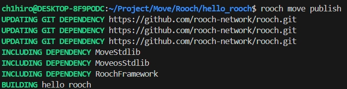
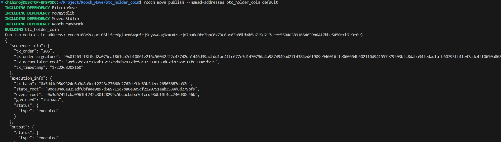
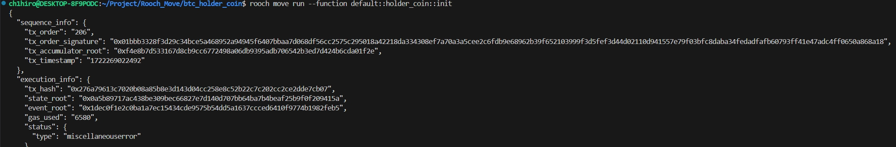
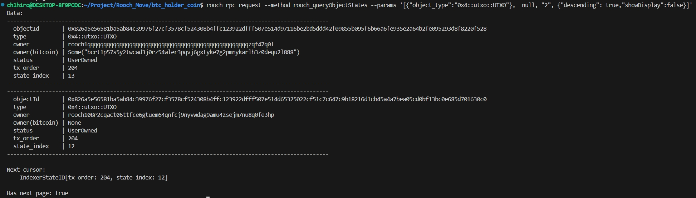
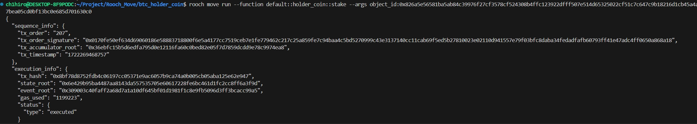
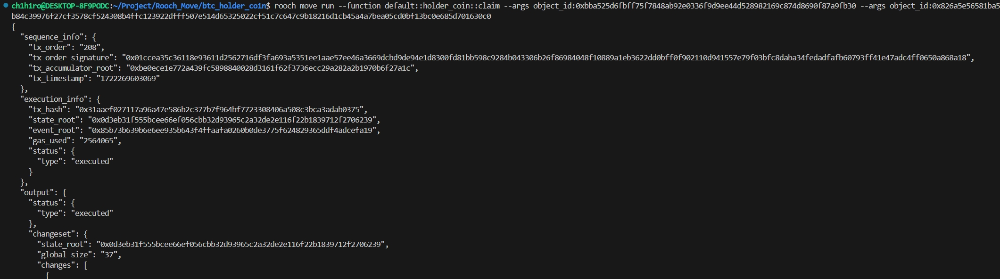
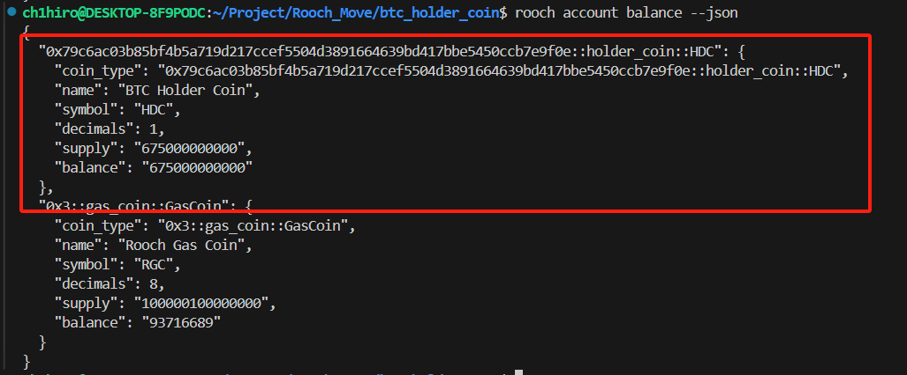

# 学习日志

## Task1：搭建比特币节点

通过 `docker` 运行 `bitcore` 节点

```shell
# 拉取镜像
sudo docker pull lncm/bitcoind:v25.1

# 运行
sudo docker run lncm/bitcoind:v25.1
```

运行结果：


## Task2：部署第一个合约

1. 安装 `rooch` 编译器

   ```
   # 安装依赖项
   sudo apt install git curl cmake make gcc lld pkg-config libssl-dev libclang-dev libsqlite3-dev g++ protobuf-compiler
   # 安装 Rust
   curl --proto '=https' --tlsv1.2 -sSf https://sh.rustup.rs | sh
   # 克隆源码
   git clone https://github.com/rooch-network/rooch.git
   # 安装 Rooch
   cd rooch && cargo build && cp target/debug/rooch ~/.cargo/bin/
   ```

2. 连接到 `Rooch`

   ```
   # 初始化
   rooch init
   ```

3. 切换到测试网
   查看环境列表：`rooch env list`
   切换到 test：`rooch env switch --alias test`

4. 创建第一个项目
   `rooch move new hello_rooch`

5. 创建合约并添加 move 代码

   ```rust
   module hello_rooch::hello_rooch {
       use moveos_std::account;
       use std::string;
       struct HelloMessage has key {
           text: string::String
       }
       entry fun say_hello(owner: &signer) {
           let hello = HelloMessage { text: string::utf8(b"Hello Rooch!") };
           account::move_resource_to(owner, hello);
       }
   }
   ```

6. 部署合约
   `rooch move publish`



## Task3: UTXO

### 3.1、搭建Bitcoin开发环境

1、启动一个 **Bitcoin** 节点，这里用 **docker** 容器

```bash
ch1hiro@DESKTOP-8F9PODC:~/Environment/rooch/scripts/bitcoin$ ./node/run_local_node_docker.sh
```

**错误：**
	会发现容器没起来，用 `docker logs 容器id` 查看原因，指出是没有权限创建文件，`sudo chmod 777 <path> `，`docker ps` 查看重新启动成

2、在本地启动 **Rooch**

```
rooch server start --btc-rpc-url http://127.0.0.1:18443 --btc-rpc-username roochuser --btc-rpc-password roochpass
```

### 3.2、部署合约

https://github.com/rooch-network/rooch/tree/main/examples/btc_holder_coin

- 将配置文件换成本地依赖

```toml
MoveosStdlib = { local = "../../../Environment/rooch/frameworks/moveos-stdlib" }
RoochFramework = { local = "../../../Environment/rooch/frameworks/rooch-framework" }
BitcoinMove = { local = "../../../Environment/rooch/frameworks/bitcoin-move" }
```

1、`rooch move publish --named-addresses btc_holder_coin=default`



2、调用 `init` 函数进行初始化

```
rooch move run --function default::holder_coin::init
```



3、**bitcoin cli** 生成区块

我用的是 **docker** 容器生成的

`docker exec bitcoind_regtest bitcoin-cli -regtest generatetoaddress 101 bcrt1p57s5y2twcad3j0rz54wler3pqvj6gxtyke7g2pmnykarlh3z0dequ2l888`

4、查询 **UTXO id**

`rooch rpc request --method rooch_queryObjectStates --params '[{"object_type":"0x4::utxo::UTXO"},  null, "2", {"descending": true,"showDisplay":false}]'`



5、调用质押函数 `stake`

`rooch move run --function default::holder_coin::stake --args object_id:0x826a5e56581ba5ab84c39976f27cf3578cf524308b4ffc123922dfff507e514d65325022cf51c7c647c9b18216d1cb45a4a7bea05cd0bf13bc0e685d701630c0`

- **stake()：**

```rust
public entry fun stake(utxo: &mut Object<UTXO>){
   do_stake(utxo);
}
```

这里的 **object_id**，是 **UTXO** 对象



6、调用`claim`函数，领取代币

`rooch move run --function default::holder_coin::claim --args object_id:0xbba525d6fbff75f7848ab92e0336f9d9ee44d528982169c874d8690f87a9fb30 --args object_id:0x826a5e56581ba5ab84c39976f27cf3578cf524308b4ffc123922dfff507e514d65325022cf51c7c647c9b18216d1cb45a4a7bea05cd0bf13bc0e685d701630c0`

- **claim()：**

```rust
public entry fun claim(coin_info_holder_obj: &mut Object<CoinInfoHolder>, utxo: &mut Object<UTXO>) {
    let coin = do_claim(coin_info_holder_obj, utxo);
    let sender = tx_context::sender();
    account_coin_store::deposit(sender, coin);
}
```

这里第一个 **object_id** 是 `CoinInfoHolder` 的 **ID**



7、查询余额

`rooch account balance --json`


