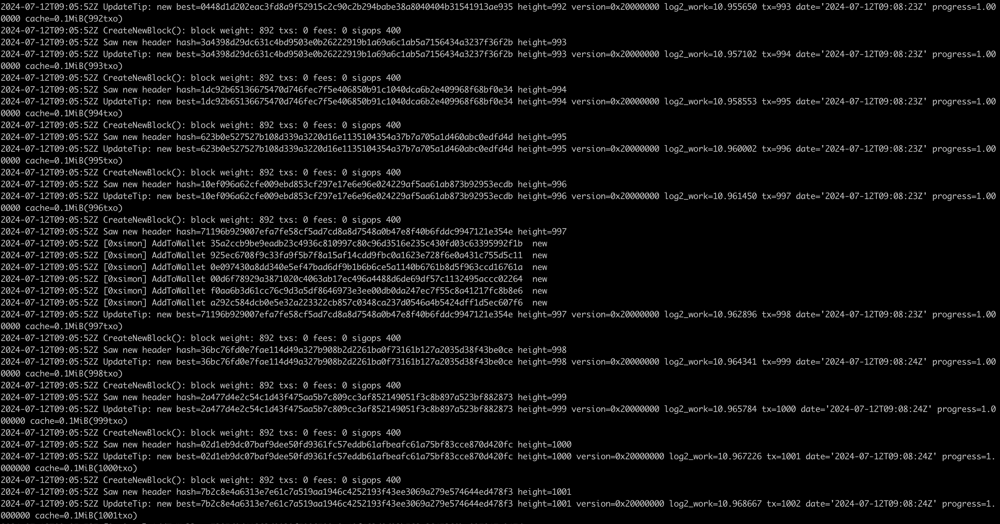
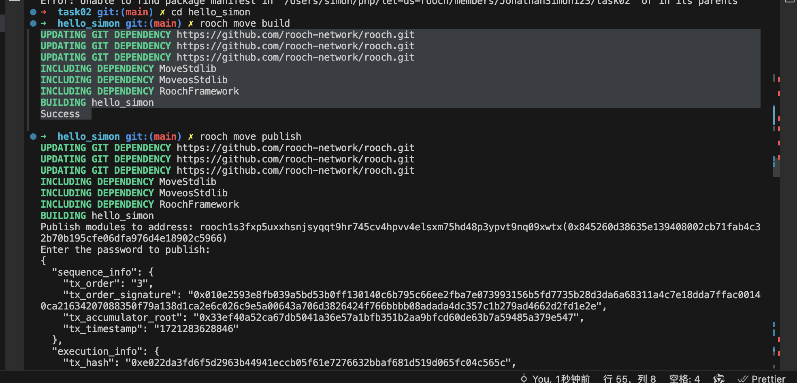

# 学习日志

### task01:



```
# The bitcoin data in the host machine is stored in $HOME/.bitcoin/regtest
docker run -d \
    --name bitcoind_regtest \
    -p 18443:18443 \
    -p 18444:18444 \
    -p 28333:28333 \
    -p 28332:28332 \
    -v $HOME/.bitcoin:/data/.bitcoin \
    lncm/bitcoind:v25.1 \
    -chain=regtest \
    -txindex=1 \
    -fallbackfee=0.00001 \
    -zmqpubrawblock=tcp://0.0.0.0:28332 \
    -zmqpubrawtx=tcp://0.0.0.0:28333 \
    -rpcallowip=0.0.0.0/0 \
    -rpcbind=0.0.0.0 \
    -rpcauth='roochuser:925300af2deda1996d8ff66f2a69dc84$681057d8bdccae2d119411befa9a5f949eff770933fc377816348024d25a2402'
```

### task02:

1. 安装Rooch `` git clone https://github.com/rooch-network/rooch``    ``cd rooch&rustc build``   ``cp ./target/debug/rooch /usr/local/bin`` [参考文档](https://rooch.network/zh-CN/build/getting-started/installation)
2. ``rooch init``  创建地址 & 获取Gas    [discord](https://discord.com/channels/1078938449974935592/1241937567809667184)
3. 创建一个move合约 `` rooch move new hello_simon``
   ```module
   use moveos_std::account;
   use std::string;
   struct HelloMessage has key {
       text: string::String
   }

   entry fun say_hello(owner: &signer) {
       let hello = HelloMessage { text: string::utf8(b"Hello Simon!") };
       account::move_resource_to(owner, hello);
   }
   }```
   ```
4. ``rooch move build``
   log:UPDATING GIT DEPENDENCY https://github.com/rooch-network/rooch.git
   UPDATING GIT DEPENDENCY https://github.com/rooch-network/rooch.git
   UPDATING GIT DEPENDENCY https://github.com/rooch-network/rooch.git
   INCLUDING DEPENDENCY MoveStdlib
   INCLUDING DEPENDENCY MoveosStdlib
   INCLUDING DEPENDENCY RoochFramework
   BUILDING hello_simon
   Success
5. ```shell
    rooch move publish
   ```

    