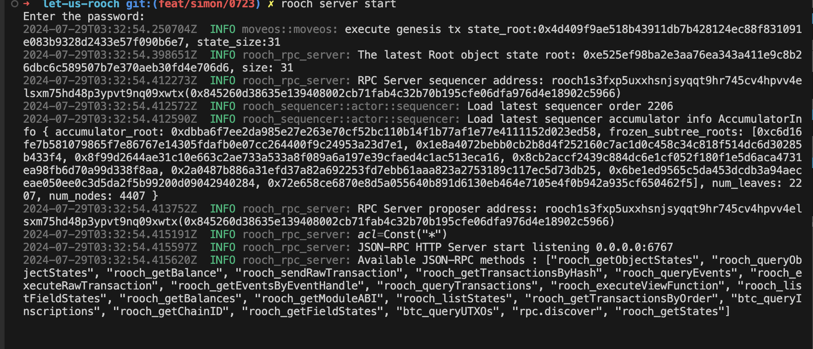
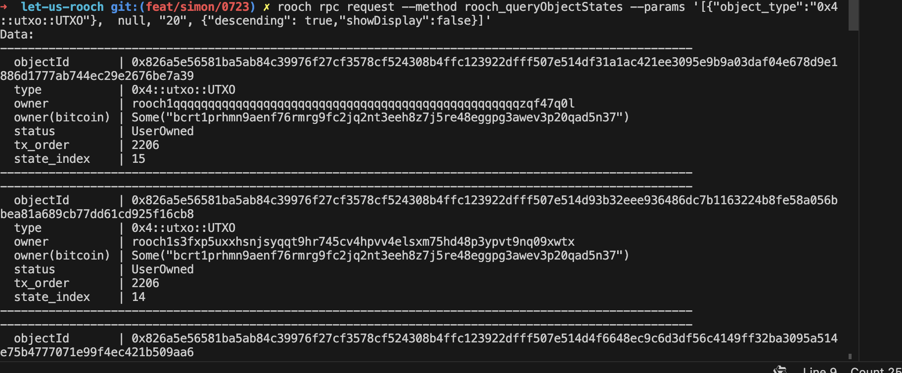
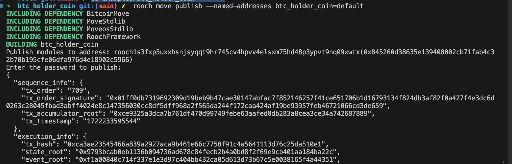
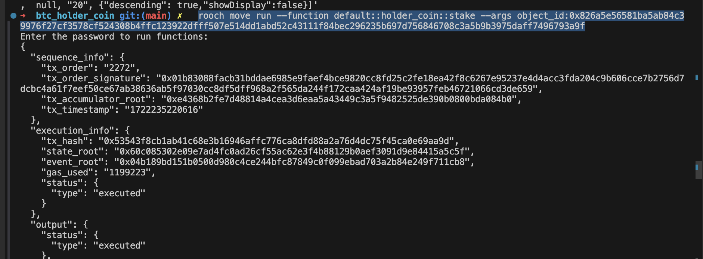
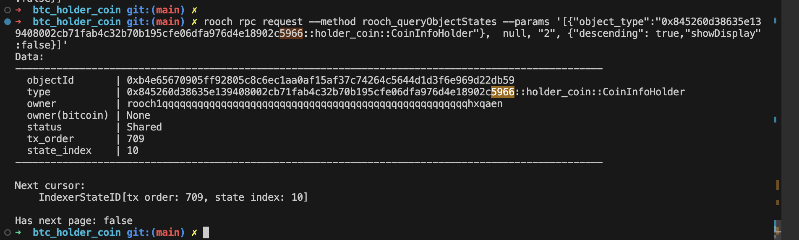
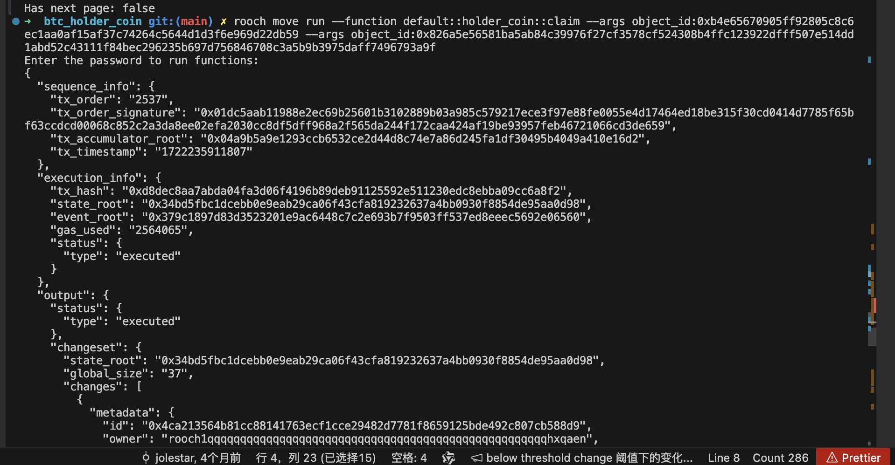
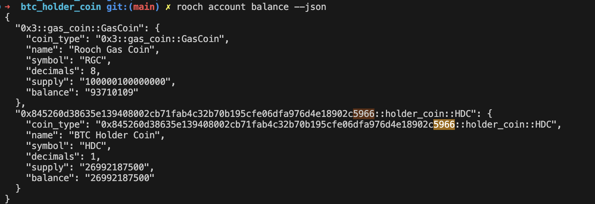

## 部署本地环境bitcoin&Rooch开发环境

docker 运行task01的bitcoin镜像 详细按参考

`rooch server start `

`rooch rpc request --method rooch_queryObjectStates --params '[{"object_type":"0x4::utxo::UTXO"},  null, "20", {"descending": true,"showDisplay":false}]'`

## 部署 BTC_HOLDER_COIN合约&调用

更新官方例子[btc_holder_coin](https://github.com/rooch-network/rooch/tree/main/examples/btc_holder_coin) 部署 btc_holder_coin 合约

完成初始化 `rooch move run --function default::holder_coin::init`

完成质押

`rooch move run --function default::holder_coin::stake --args object_id:0x826a5e56581ba5ab84c39976f27cf3578cf524308b4ffc123922dfff507e514dd1abd52c43111f84bec296235b697d756846708c3a5b9b3975daff7496793a9f`

rooch rpc request --method rooch_queryObjectStates --params '[{"object_type":"0x845260d38635e139408002cb71fab4c32b70b195cfe06dfa976d4e18902c5966::holder_coin::CoinInfoHolder"},  null, "2", {"descending": true,"showDisplay":false}]'

`rooch move run --function default::holder_coin::claim --args object_id:0x845260d38635e139408002cb71fab4c32b70b195cfe06dfa976d4e18902c5966 --args object_id:0x826a5e56581ba5ab84c39976f27cf3578cf524308b4ffc123922dfff507e514dd1abd52c43111f84bec296235b697d756846708c3a5b9b3975daff7496793a9f`

rooch account balance --json

