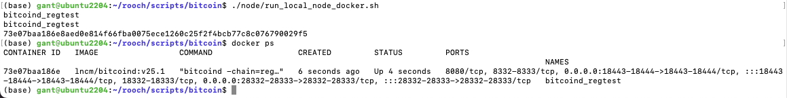
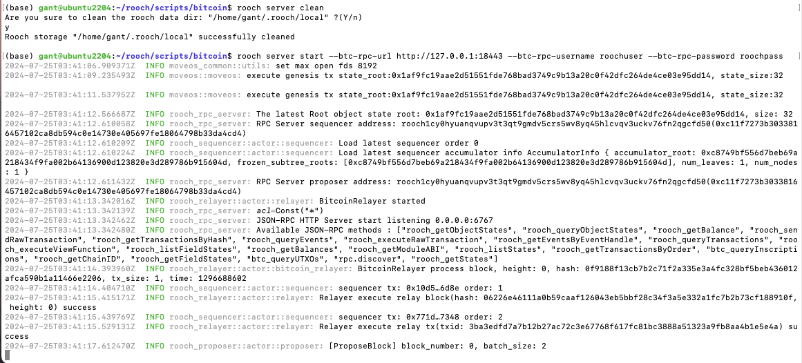
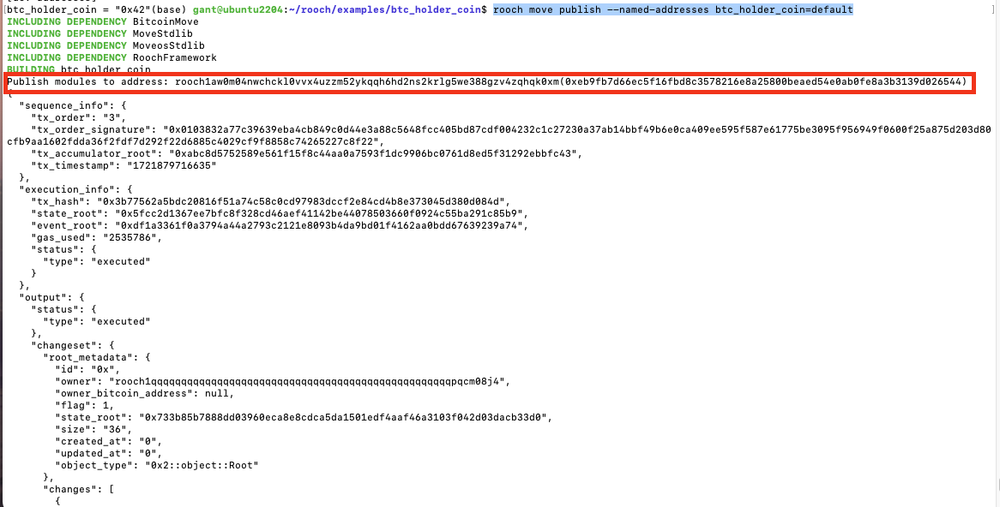
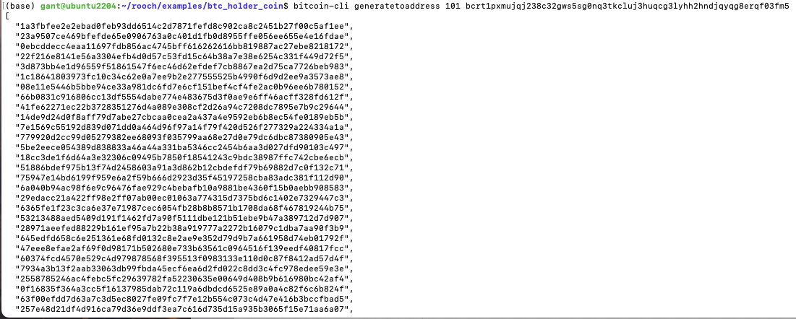
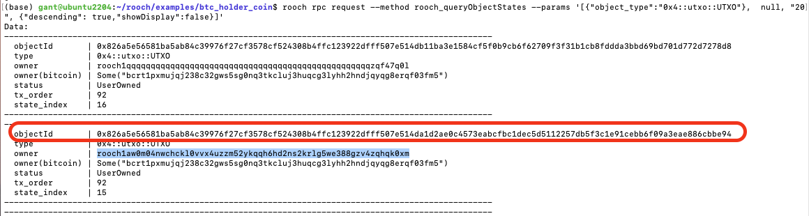
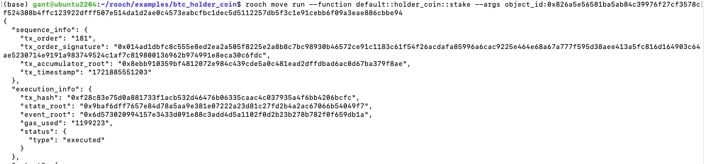
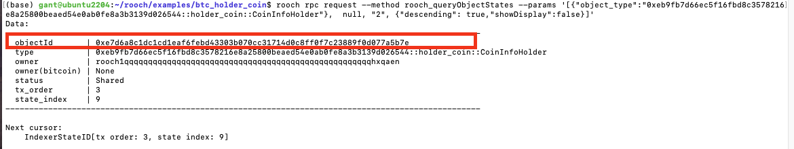
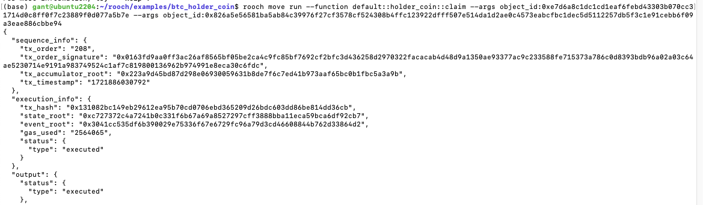
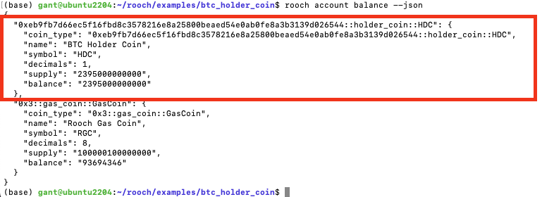

# 7.24 Homework3
## 作业要求：
* 搭建本地 Bitcoin 以及 Rooch 开发环境，部署一个和 Bitcoin 数据交互的Move 智能合约，并且进行调用。

### 一. 搭建本地Bitcoin以及Rooch开发环境
参考rooch提供的官方[脚本](https://github.com/rooch-network/rooch/tree/main/scripts/bitcoin)，搭建Bitcoin regtest测试网以及启动rooch server。  
pre-requirements:
* 安装docker

1. 执行脚本，将启动docker容器，bitcoin regtest网络将会启动  
  
如果遇到容器无法启动，使用`docker logs bitcoin_regtest`查看容器日志，看看哪出问题了。  
2. 执行别名操作，方便命令执行  
    ```
    alias bitcoin-cli="docker exec -it bitcoind_regtest bitcoin-cli -regtest"
    ```  
3. 启动rooch服务，启动前先清除之前的数据
    ```
    rooch server clean
    rooch server start --btc-rpc-url http://127.0.0.1:18443 --btc-rpc-username roochuser --btc-rpc-password roochpass
    ```
      
rooch server已经正常启动, 本地环境搭建完毕。


### 二. 部署move合约，并与Bitcoin数据进行交互
在这里使用rooch官方提供的example里面的[btc_holder_coin](https://github.com/rooch-network/rooch/tree/main/examples/btc_holder_coin)合约例子。这份合约实现了一个名为 btc_holder_coin::holder_coin 的 Move 模块，旨在通过质押（stake）比特币未花费交易输出（UTXO）来获取 BTC Holder Coin (HDC)。具体的代码解释写在这份[文档](./code_explain.md)里。  

1. 部署合约，进入到rooch/examples/btc_holder_coin目录，然后执行部署
    ```
    rooch move publish --named-addresses btc_holder_coin=default
    ```
      
    观察到合约成功部署到了我们的账户地址上面。这个地址要记录下，后面要用。

2. 合约部署好了，调用init函数进行初始化
    ```
    rooch move run --function default::holder_coin::init
    ```
3. 初始化完之后，开始质押，质押需要utxo，所以先给当前账户生成区块。
    ```
    # 查看账户
    rooch account list --json
    # 生成区块
    bitcoin-cli generatetoaddress 101 <bitcoin_address>
    ```
      
4. 区块生成之后，就可以查询它的utxo id了
    ```
    rooch rpc request --method rooch_queryObjectStates --params '[{"object_type":"0x4::utxo::UTXO"},  null, "20", {"descending": true,"showDisplay":false}]'
    ```
    
    注意选择owner是当前账户地址的objectId  
5. 接下来开始质押utxo，调用质押函数
    ```
    rooch move run --function default::holder_coin::stake --args object_id:0x826a5e56581ba5ab84c39976f27cf3578cf524308b4ffc123922dfff507e514da1d2ae0c4573eabcfbc1dec5d5112257db5f3c1e91cebb6f09a3eae886cbbe94
    ```
      
    质押成功。  
6. 质押完成之后，调用claim函数，领取代币，需要知道CoinInfoHolder的objectId。
    ```
    # 查询CoinInfoHolder的objectId
    rooch rpc request --method rooch_queryObjectStates --params '[{"object_type":"0xeb9fb7d66ec5f16fbd8c3578216e8a25800beaed54e0ab0fe8a3b3139d026544::holder_coin::CoinInfoHolder"},  null, "2", {"descending": true,"showDisplay":false}]'
    ```
    这里的地址是你部署该合约的账户地址。  
      
    ```
    # 调用claim，领取代币
    rooch move run --function default::holder_coin::claim --args object_id:0xe7d6a8c1dc1cd1eaf6febd43303b070cc31714d0c8ff0f7c23889f0d077a5b7e --args object_id:0x826a5e56581ba5ab84c39976f27cf3578cf524308b4ffc123922dfff507e514da1d2ae0c4573eabcfbc1dec5d5112257db5f3c1e91cebb6f09a3eae886cbbe94
    ```
      
    成功调用claim函数。  
7. 查询代币余额
    ```
    rooch account balance --json
    ```
      
    成功领取到代币$HDC

还可以使用其他账户进行质押utxo和领取代币，rooch account create创建新账户就行了

