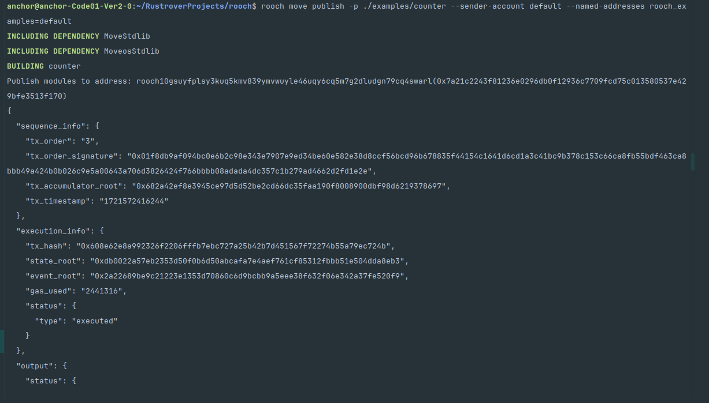
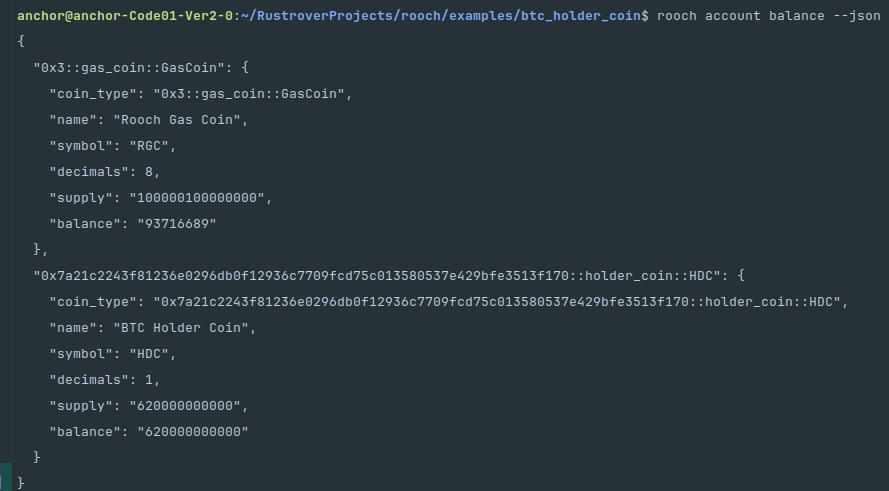
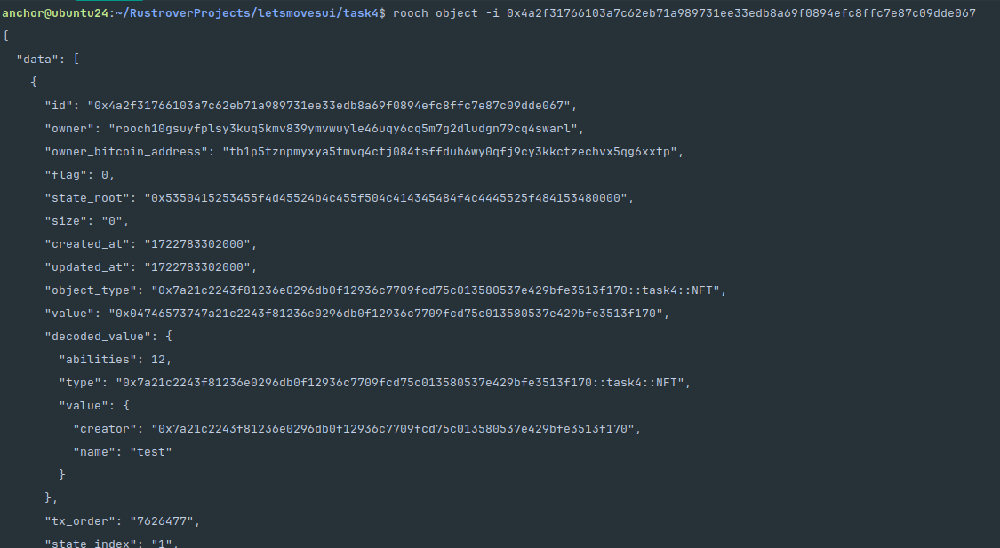
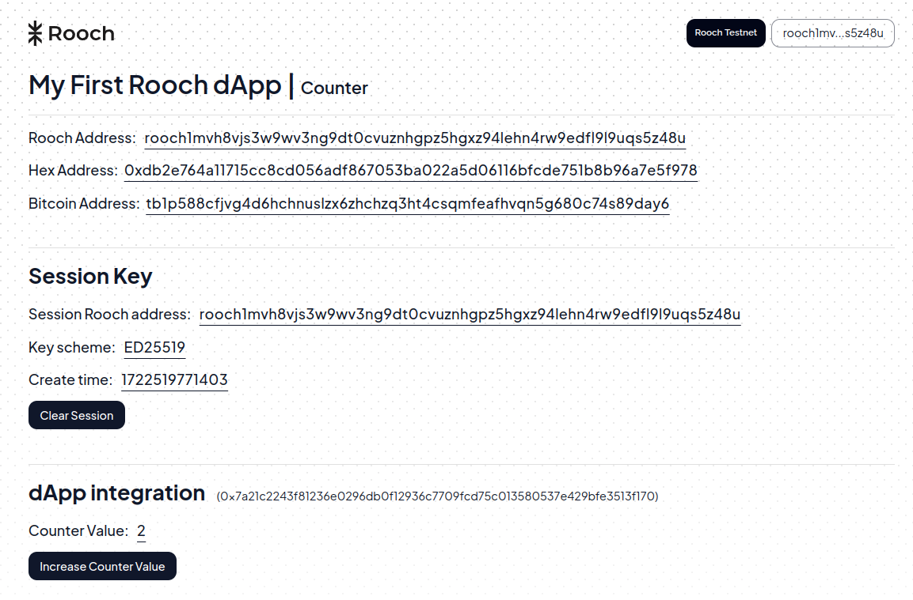
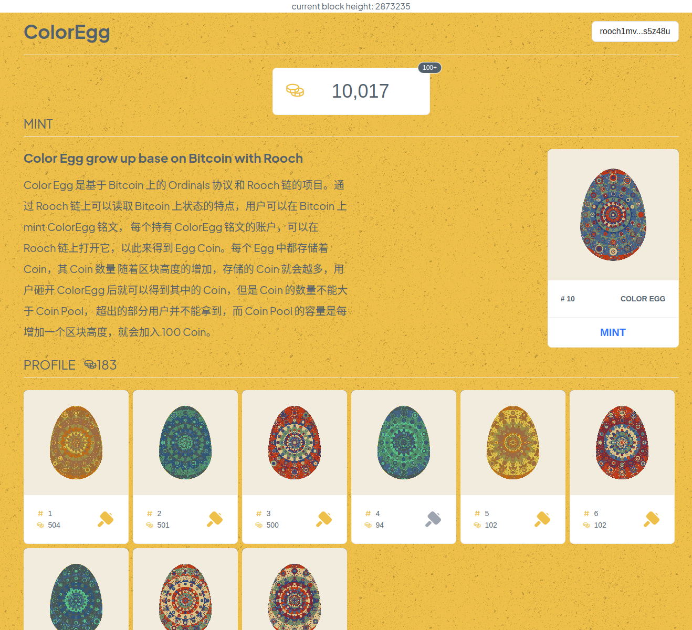

# Let's Rooch 训练营加入申请表

### 个人介绍

* Github ID：[TheHeBoy](https://github.com/TheHeBoy)

* 微信号：13786994031

* 邮箱：q619215399@gmail.com

* BTC 地址：bc1ppk656w77ayrdlhy6c9hpe5u6dm6dt66qtj4j85t2c0q32cgg343s4cuxya

之前做 ETH 生态的 dapp 开发，最近在 BTC 做 Inscrptions nft 相关的项目，对于区块链非常感兴趣，后端开发主要语言：Java，Golang 和 Rust（学习中...）。

### 学习日志

- [学习日志](journal.md)
- [学习总结](summary.md)

### 学习成果
- [x] Bitcoin 全节点
  - 
- [X] 部署你的第一个合约
  - 
- [X] 部署一个和 Bitcoin 交互的合约，使用质押合约
  - 
- [X] NFT合约 mint 需要检查是否持有btc，并且支付 gas coin 当作服务费, [task4 code](code/task4)
  - 
- [X] 创建一个 Counter 工程
  - 
- [X] Demo ColorEgg. [demo code](code/demo)
  - 成员： TheHeBoy(全栈工程师)，newblock(算法艺术家)
  - 介绍： Color Egg 是基于 Bitcoin 上的 Ordinals 协议 和 Rooch 链的项目。通过 Rooch 链上可以读取
    Bitcoin 上状态的特点，用户可以在 Bitcoin 上 mint ColorEgg 铭文， 每个持有 ColorEgg 铭文的账户，
    可以在 Rooch 链上打开它，以此来得到 Egg Coin。每个 Egg 中都存储着 Coin，其 Coin 数量 随着区块高度的增加，
    存储的 Coin 就会越多，用户砸开 ColorEgg 后就可以得到其中的 Coin，但是 Coin 的数量不能大于 Coin Pool，
    超出的部分用户并不能拿到，而 Coin Pool 的容量是每增加一个区块高度，就会加入 100 Coin。
  - 