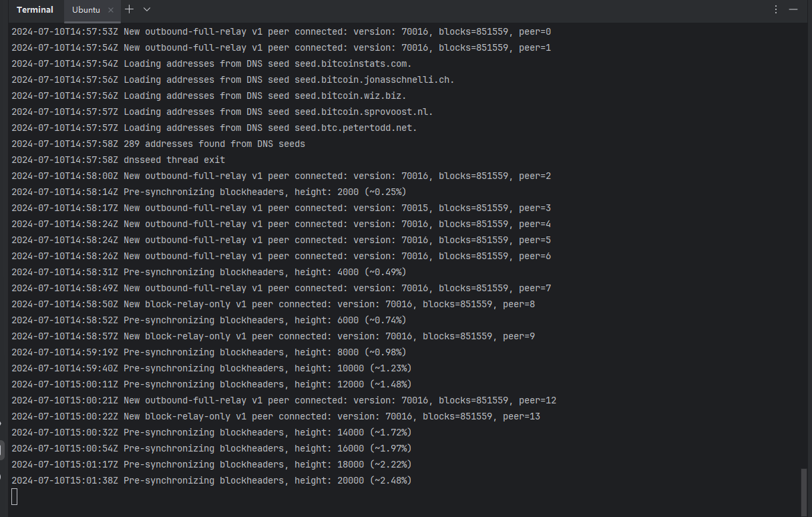

# Let's Rooch 训练营加入申请表

### 个人介绍

* Github ID：[TheHeBoy](https://github.com/TheHeBoy)

* 微信号：13786994031

* 邮箱：q619215399@gmail.com

* BTC 地址：bc1ppk656w77ayrdlhy6c9hpe5u6dm6dt66qtj4j85t2c0q32cgg343s4cuxya

之前做 ETH 生态的 dapp 开发，最近在 BTC 做 Inscrptions nft 相关的项目，对于区块链非常感兴趣，后端开发主要语言：Java，Golang 和 Rust（学习中...）。

### 学习日志

- [学习日志](journal.md)
- [学习总结](summary.md)

### 学习成果
- [x] Bitcoin 全节点

