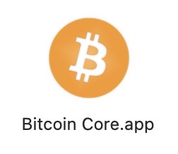
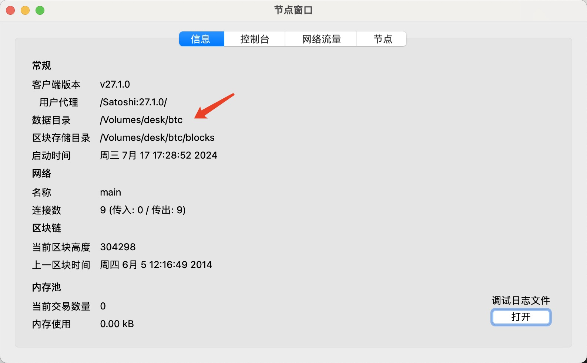
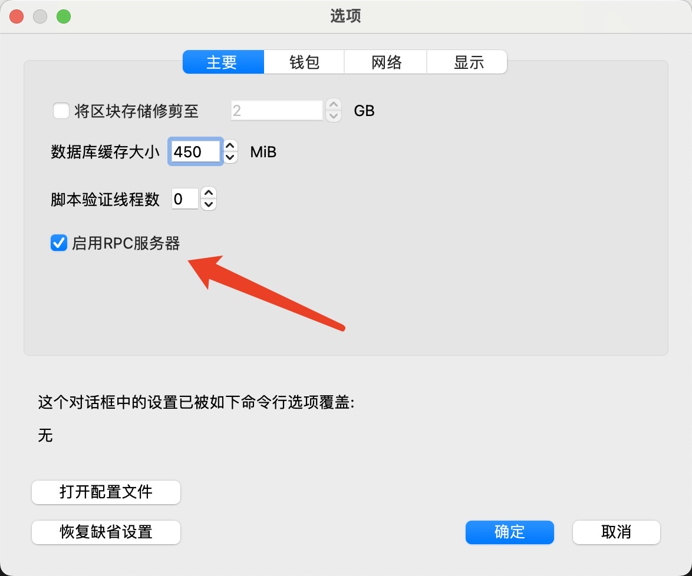
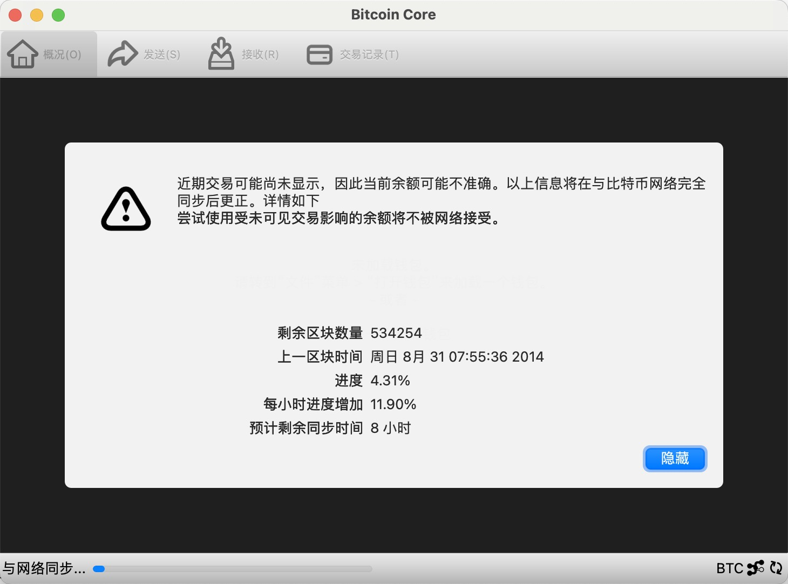
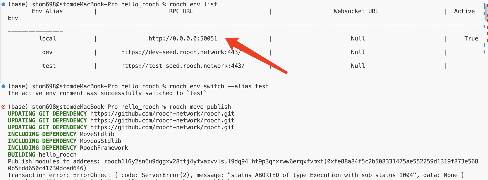
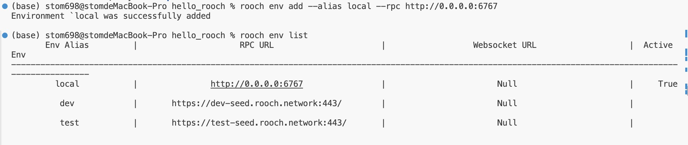
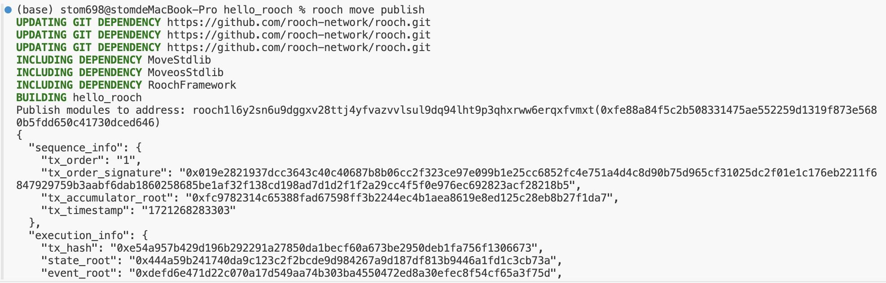
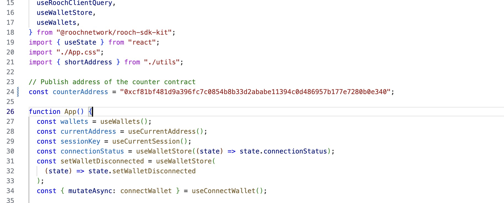
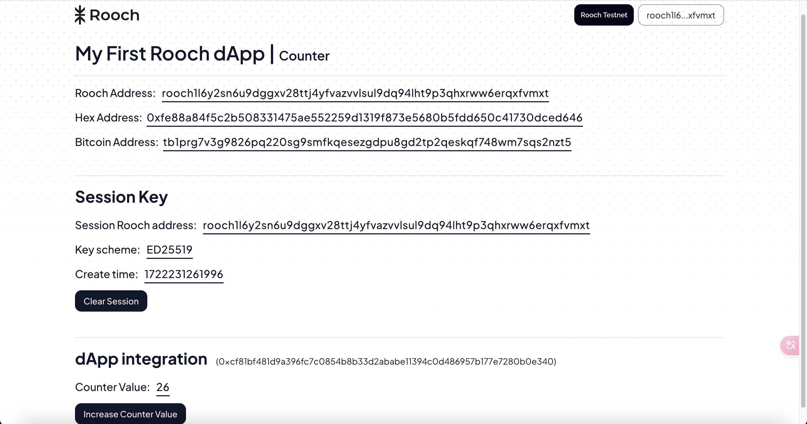

# 学习日志
**task1**  
1、mac安装bitcoin core  
访问 https://bitcoincore.org/en/download/ 下载bitcoin core.app并将其放入应用程序    
    
然后打开app，配置数据目录    
  
并且开启rpc节点  
  
等区块同步完成  
  

**task2**  
1、修改rpc  
原rpc端口为50051修改为新端口6767  
  
  
2、部署合约  
  

**task3**  
1、部署dapp  
下载代码  
 `git clone https://github.com/rooch-network/my-first-rooch-dapp.git`  
安装bun  
`curl -fsSL https://bun.sh/install | bash`  
下载依赖  
`bun install`
部署  
`my-first-rooch-dapp % bun dev`  
`counter_contract % rooch move publish --named-addresses quick_start_counter=default`  
然后修改app.tsx  
   
2、合约交互  
  