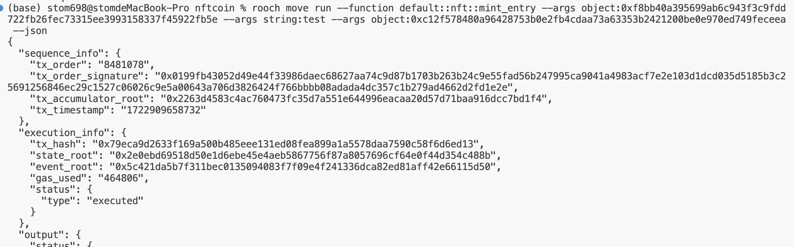

# 学习日志
**task1**  
1、mac安装bitcoin core  
访问 https://bitcoincore.org/en/download/ 下载bitcoin core.app并将其放入应用程序    
    
然后打开app，配置数据目录    
  
并且开启rpc节点  
  
等区块同步完成  
  

**task2**  
1、修改rpc  
原rpc端口为50051修改为新端口6767  
  
  
2、部署合约  
  

**task3**  
1、部署dapp  
下载代码  
 `git clone https://github.com/rooch-network/my-first-rooch-dapp.git`  
安装bun  
`curl -fsSL https://bun.sh/install | bash`  
下载依赖  
`bun install`
部署  
`my-first-rooch-dapp % bun dev`  
`counter_contract % rooch move publish --named-addresses quick_start_counter=default`  
然后修改app.tsx  
   
2、合约交互  
  

**task4**  
1、部署合约  
`rooch move publish --json`

获取Treasury  
`0xc12f578480a96428753b0e2fb4cdaa73a63353b2421200be0e970ed749feceea`

2、获取FSC coin  
```
rooch move run --function default::nft::faucet --args object:0xc12f578480a96428753b0e2fb4cdaa73a63353b2421200be0e970ed749feceea --json
```  
  
3、create_collection  
```
rooch move run --function default::collection::create_collection_entry --args string:test --args string:test --args address:rooch15un9ky539eume4qsjpt7d73wft53tsewlvyyzgzfpyyywyk4mw2qv28808 --args string:test --args 10 --json
```  
  
4、mint nft  
```
rooch move run --function default::nft::mint_entry --args object:0xf8bb40a395699ab6c943f3c9fdd722fb26fec73315ee3993158337f45922fb5e --args string:test --args object:0xc12f578480a96428753b0e2fb4cdaa73a63353b2421200be0e970ed749feceea --json
```  
  

**task5** 
部署counter  
  

**demo**
random  
```
rooch move run --function default::random::get_random --args object:0x2::timestamp::Timestamp --args u64:100 --sender-account default  
```  
本来想写发红包的应用，时间有限没写好T_T