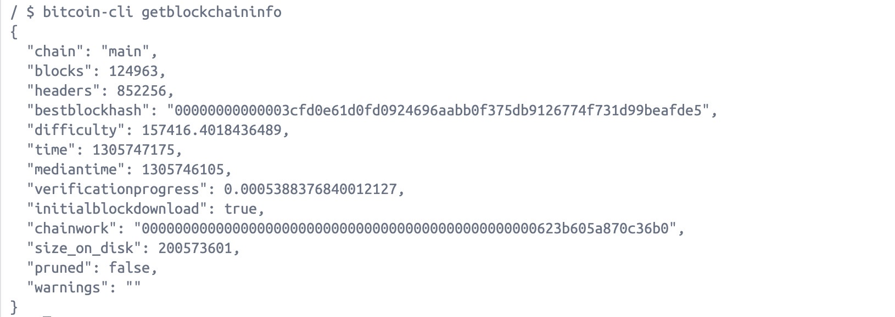

# 学习日志
1、
安装 `docker` 和 `ord`
运行 `./node/run_local_node_docker.sh` 启动本地 `Bitcoin Core` 节点
运行 `source ./cmd_alias.sh` 为运行 `bitcoin-cli` 和 `ord` 命令设置别名

然后启动镜像同步区块
执行 `bitcoin-cli getblockchaininfo` 查看
