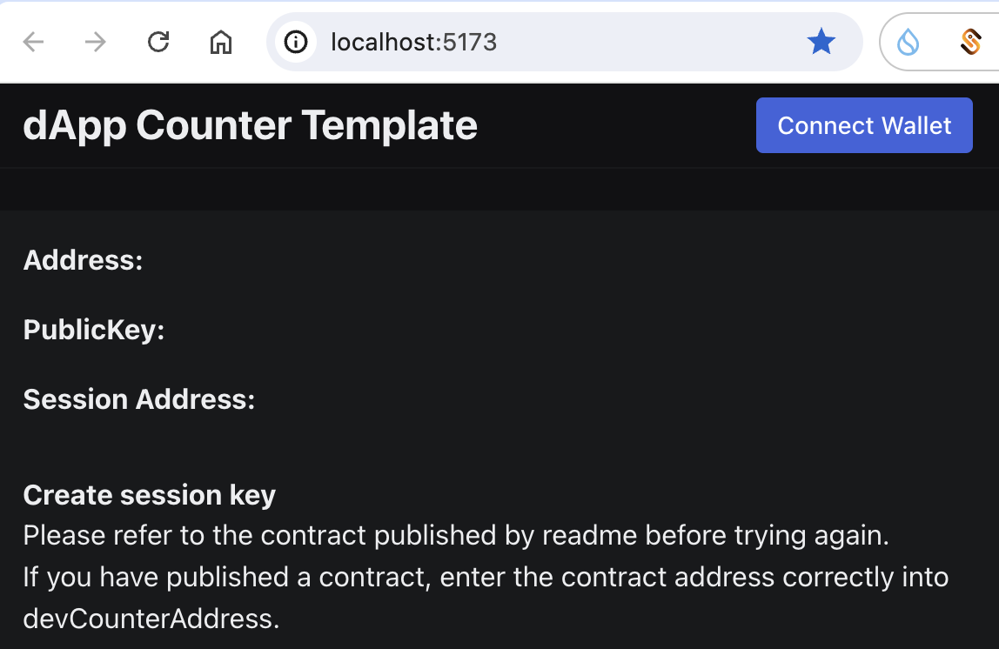
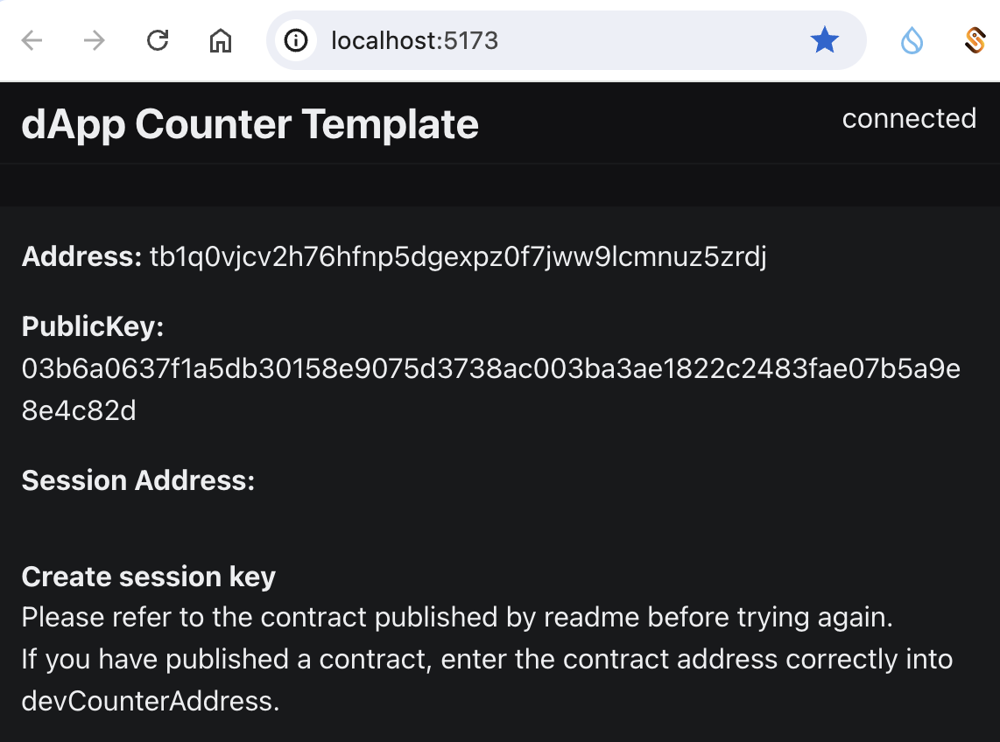
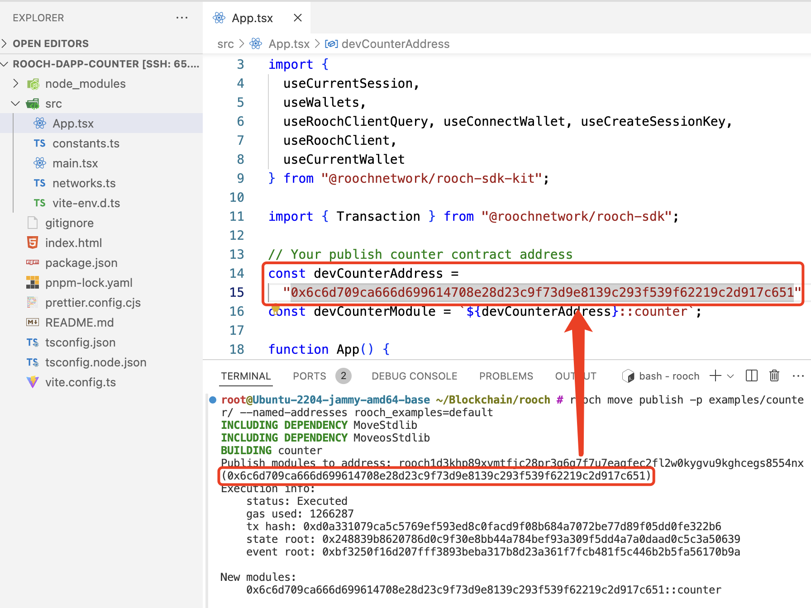
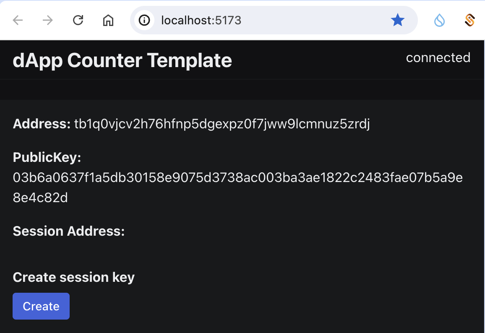
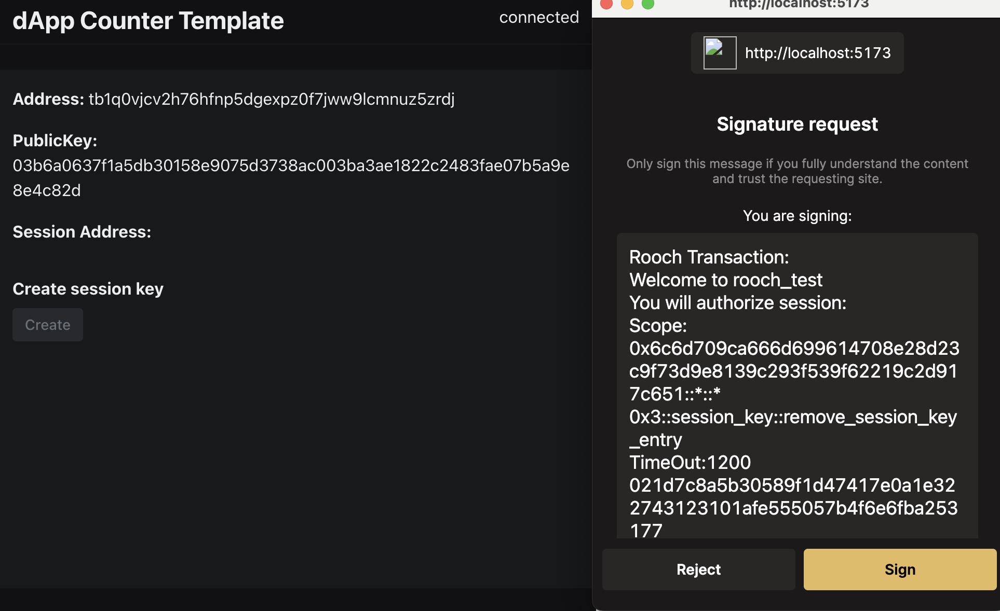
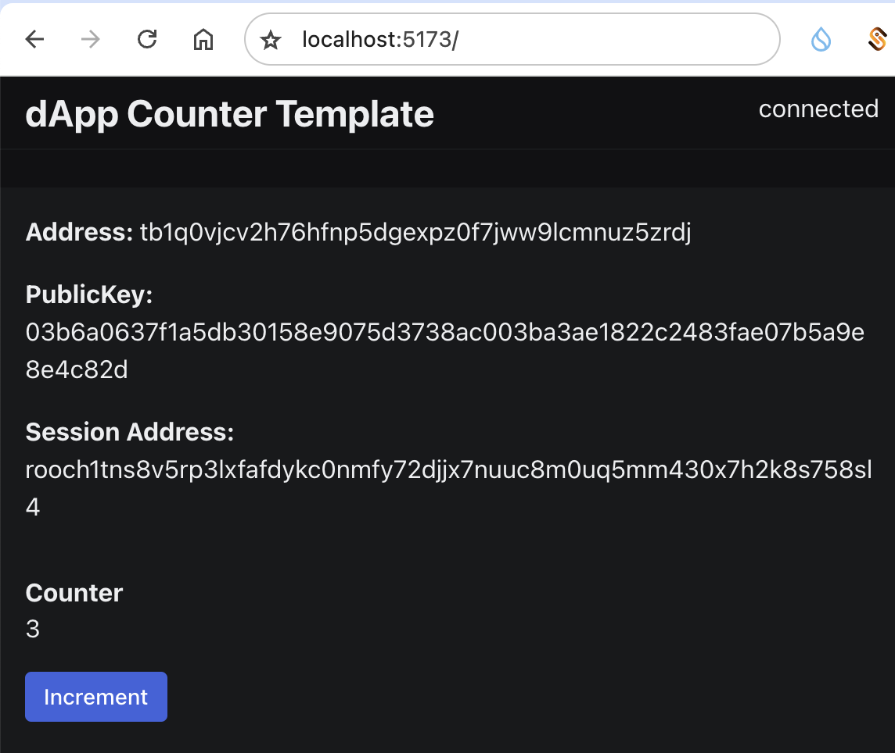

# Task5: 使用pnpm 创建一个 Counter 工程

## 1 账号初始化

```bash
$ ./target/release/rooch init
Creating client config file ["/root/.rooch/rooch_config/rooch.yaml"].
Enter a password to encrypt the keys. Press enter to leave it an empty password: 
Generated new keypair for address [rooch1d3khp89xvmtfjc28pr3g6g7f7u7eaqfec2fl2w0kygvu9kghcegs8554nx]
Secret Recovery Phrase : [flag neither egg ordinary beyond delay dry fault main raise main ranch]
Rooch client config file generated at /root/.rooch/rooch_config/rooch.yaml
```

## 2 查看地址

```json
rooch account list --json
{
  "default": {
    "address": "rooch1d3khp89xvmtfjc28pr3g6g7f7u7eaqfec2fl2w0kygvu9kghcegs8554nx",
    "hex_address": "0x6c6d709ca666d699614708e28d23c9f73d9e8139c293f539f62219c2d917c651",
    "bitcoin_address": "tb1pqftd594002zslv5g47g43tqe60r4xjl6t798fcxxh52jqshpke5sgrj08y",
    "nostr_public_key": "npub1yf9y0x2uw0lps634hvwqcvrwtjzfwdd586nsr03tfuhk64ps9rsskc2rt6",
    "public_key": "AQIiSkeZXHP+GGo1uxwMMG5chJc1tD6nAb4rTy9tVDAo4Q==",
    "has_session_key": false,
    "active": true
  }
}
```

## 3 领水


```json
rooch account balance --json
{
  "0x3::gas_coin::GasCoin": {
    "coin_type": "0x3::gas_coin::GasCoin",
    "name": "Rooch Gas Coin",
    "symbol": "RGC",
    "decimals": 8,
    "supply": "300000100000000",
    "balance": "1000000000"
  }
}
```

## 4 工程创建

```bash
$ pnpm create @roochnetwork/create-rooch@latest
.../1911843e744-e3da9                    |   +6 +
.../1911843e744-e3da9                    | Progress: resolved 6, reused 0, downloaded 6, added 6, done
✔ Which starter template would you like to use? · react-counter
✔ What is the name of your dApp? (this will be used as the directory name) · rooch-dapp-counter
```

## 5 安装依赖包

```bash
$ pnpm i
Downloading @swc/core-linux-x64-gnu@1.7.5: 17.24 MB/17.24 MB, done
Downloading @swc/core-linux-x64-musl@1.7.5: 21.00 MB/21.00 MB, done
 WARN  5 deprecated subdependencies found: @humanwhocodes/config-array@0.11.14, @humanwhocodes/object-schema@2.0.3, glob@7.2.3, inflight@1.0.6, rimraf@3.0.2
Packages: +262
+++++++++++++++++++++++++++++++++++++++++++++++++++++++++++++++++++++++++++++++++++
Progress: resolved 292, reused 3, downloaded 259, added 262, done
node_modules/.pnpm/@swc+core@1.7.5/node_modules/@swc/core: Running postinstall script...
node_modules/.pnpm/@swc+core@1.7.5/node_modules/@swc/core: Running postinstall script, done in 41ms
node_modules/.pnpm/esbuild@0.18.20/node_modules/esbuild: Running postinstall script, done in 36ms

dependencies:
+ @radix-ui/colors 3.0.0
+ @radix-ui/react-icons 1.3.0
+ @radix-ui/themes 2.0.3 (3.1.1 is available)
+ @roochnetwork/rooch-sdk 0.2.2
+ @roochnetwork/rooch-sdk-kit 0.2.2
+ @tanstack/react-query 5.51.21
+ react 18.3.1
+ react-dom 18.3.1

devDependencies:
+ @types/react 18.3.3
+ @types/react-dom 18.3.0
+ @typescript-eslint/eslint-plugin 6.21.0 (8.0.0 is available)
+ @typescript-eslint/parser 6.21.0 (8.0.0 is available)
+ @vitejs/plugin-react-swc 3.7.0
+ eslint 8.57.0 (9.8.0 is available)
+ eslint-plugin-react-hooks 4.6.2
+ eslint-plugin-react-refresh 0.4.9
+ prettier 3.3.3
+ typescript 5.5.4
+ vite 4.5.3 (5.3.5 is available)
```

## 6 启动dapp

```bash
$ pnpm dev

  VITE v4.5.3  ready in 106 ms

  ➜  Local:   http://localhost:5173/
  ➜  Network: use --host to expose
  ➜  press h to show help
```



## 7 连接钱包



## 8 部署合约

```bash
$ rooch move publish -p examples/counter/ --n
amed-addresses rooch_examples=default

INCLUDING DEPENDENCY MoveStdlib
INCLUDING DEPENDENCY MoveosStdlib
BUILDING counter
Publish modules to address: rooch1d3khp89xvmtfjc28pr3g6g7f7u7eaqfec2fl2w0kygvu9kghcegs8554nx(0x6c6d709ca666d699614708e28d23c9f73d9e8139c293f539f62219c2d917c651)
Execution info:
    status: Executed
    gas used: 1234059
    tx hash: 0x64e6e22f4f50eaa472b62683ef5c92f21342432f55743898d2edb1c06028e272
    state root: 0x58bc576b2024a30786fa59eea96613cd2eb96854a018ac1aa4c45a3481d3eea3
    event root: 0x1bc4914a9aa9934f3a069993f40f183efb41bcb5745fc6630a05ce279857dc6f

New modules:
    0x6c6d709ca666d699614708e28d23c9f73d9e8139c293f539f62219c2d917c651::counter

Updated modules:
    None
```

## 9 地址更新到代码





## 10 创建session key



## 11 自增计数器



## 附：错误码查看

>   `frameworks/rooch-framework/sources/auth_validator/auth_validator.move`

```rust
    const ErrorValidateSequenceNuberTooOld: u64 = 1001;
    const ErrorValidateSequenceNumberTooNew: u64 = 1002;
    const ErrorValidateAccountDoesNotExist: u64 = 1003;
    const ErrorValidateCantPayGasDeposit: u64 = 1004;
    const ErrorValidateTransactionExpired: u64 = 1005;
    const ErrorValidateBadChainId: u64 = 1006;
    const ErrorValidateSequenceNumberTooBig: u64 = 1007;
    const ErrorValidateMaxGasAmountExceeded: u64 = 1008;
    /// The AuthKey in transaction's authenticator do not match with the sender's account auth key
    const ErrorValidateInvalidAccountAuthKey: u64 = 1009;
    /// InvalidAuthenticator, include invalid signature
    const ErrorValidateInvalidAuthenticator: u64 = 1010;
    /// The authenticator's auth validator id is not installed to the sender's account
    const ErrorValidateNotInstalledAuthValidator: u64 = 1011;
    /// The session is expired
    const ErrorValidateSessionIsExpired: u64 = 1012;
    /// The function call is beyond the session's scope
    const ErrorValidateFunctionCallBeyondSessionScope: u64 = 1013;
```

