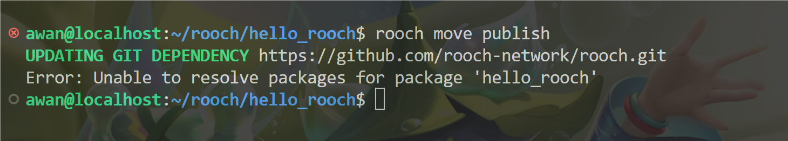
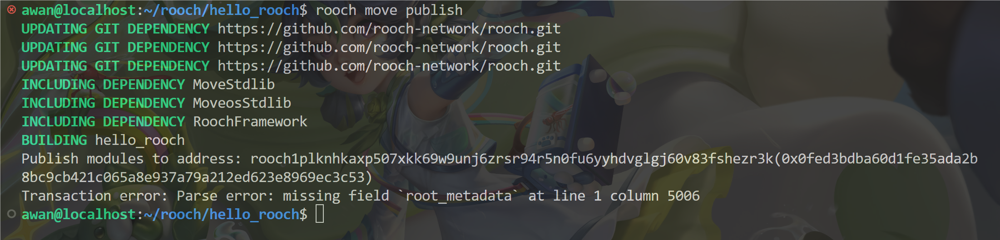
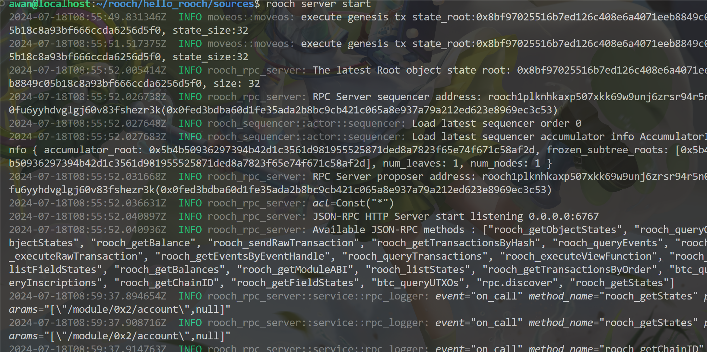
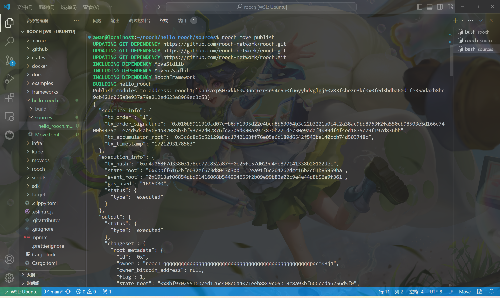

# 学习日志
* ## 第二次作业 *
本地部署了第一个`rooch`合约：
[hello_rooch](https://github.com/gunksd/let-us-rooch/blob/main/members/gunksd/Homework2/hello_rooch/sources/hello_rooch.move)
本次作业一波三折，也令我汗流浃背。

历时两天，先是前置准备工作一开始用的wsl，然后由于网络问题报了一堆错，难以解决。

故而转为Windows系统，然后在过程中又遇到了一个libc的`siginfo_t`
Type与win不兼容的问题，这个type是unix系统内置的。
想尝试着解决，添加一个跨平台的方法，

但是修改过后会导致下面的程序报错，加上我对于rust其实没多少了解，所以放弃了使用win。

然后偶然查到可以开代理的tun模式去代理本地数据，试了一下，发现就能解决Ubuntu的网络连接问题了，于是使用wsl继续工作，将之连接到vscode，然后根据官方文档部署一个最简单的`hello_rooch`
合约。

在这个过程中，又遇到了测试网和开发网部署报错的问题。

测试网的报错是：

开发网的报错是：

前者目前不知道什么原因，查询和问GPT都无果，后者似乎是由于没有update到最新的rooch版本。

最后只能在本地部署，先要在第一个命令行启动本地服务：
`rooch server start`

得到：

然后新开一个窗口，在hello_rooch目录下执行

`rooch move build`和 `rooch move publish`

最终成功部署：

## 第五次：
调用sdk 跑一个counter， create一个session key，签名之后可以increment。