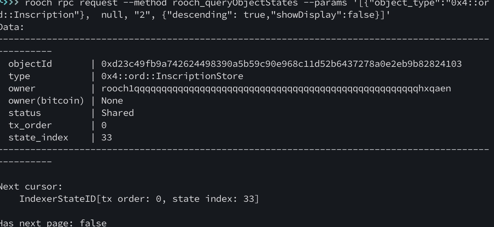

# Let's Rooch 训练营加入申请表

### 个人介绍

* Github ID：[heisenbergx626](https://github.com/heisenbergx626)

* 微信号：emptyworld0

* 邮箱：heisenbergx626@gmail.com

* BTC 地址：3LHRYjy85oS2Qz7dW7N6TgPvrzJvaHJNxd

web2 行业开发，接触过cex开发和solidity，常用golang python rust学习中。

### 学习日志

- [学习日志](journal.md)
- [学习总结](summary.md)

### 学习成果

搭建rooch 开发环境 

1. 跑bitcoin regtest
   

2. 铭文查询
   

3. utxo查询
   

4. 起rooch服务
   
