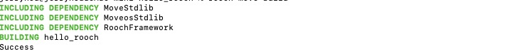

# 合约代码地址
[地址](https://github.com/houddup/hello_rooch)
# build截图
)
# 结果
```Markdown
```sh
INCLUDING DEPENDENCY MoveStdlib
INCLUDING DEPENDENCY MoveosStdlib
INCLUDING DEPENDENCY RoochFramework
BUILDING hello_rooch
Publish modules to address: rooch1rkageqlch6xlqnupdjqgmw4tcvdj32thw049dhdqtnq20jc0cy3svjt56j(0x1dba8c83f8be8df04f816c808dbaabc31b28a97773ea56dda05cc0a7cb0fc123)
{
  "sequence_info": {
    "tx_order": "3",
    "tx_order_signature": "0x01b3a8fbaddffebce385064216884076449863b8c4a41ff6befd9c7ddea19f4eae0b3f96002a2919db329319b41e5f8df92159d94ef6077a172f62045beb802bfc026c9e5a00643a706d3826424f766bbbb08adada4dc357c1b279ad4662d2fd1e2e",
    "tx_accumulator_root": "0x768d82f518b9a83e93c4d7915126a6f362d12cf71cf2203860cca32c16fdd1b0",
    "tx_timestamp": "1721544643982"
  },
  "execution_info": {
    "tx_hash": "0x1ad6aba65f55e9fd9e8fd584f6afda551d0b16acaad1e3a1f67c7ba15ec2cd40",
    "state_root": "0x13ee9f07cfcde191c0d154a1157dd876ce61fa67bb6b2cd3fe758e6456bc2181",
    "event_root": "0x3dd89520e44dee0d8c9f328d38ddd9842380163dd3cc919315d88bd8e7137a3b",
    "gas_used": "1673587",
    "status": {
      "type": "executed"
    }
  },
  "output": {
    "status": {
      "type": "executed"
    },
    "changeset": {
      "state_root": "0x13ee9f07cfcde191c0d154a1157dd876ce61fa67bb6b2cd3fe758e6456bc2181",
      "global_size": "33",
      "changes": [
        {
          "metadata": {
            "id": "0x1dba8c83f8be8df04f816c808dbaabc31b28a97773ea56dda05cc0a7cb0fc123",
            "owner": "rooch1rkageqlch6xlqnupdjqgmw4tcvdj32thw049dhdqtnq20jc0cy3svjt56j",
            "owner_bitcoin_address": null,
            "flag": 0,
            "state_root": "0x5350415253455f4d45524b4c455f504c414345484f4c4445525f484153480000",
            "size": "0",
            "created_at": "1721544643982",
            "updated_at": "1721544643982",
            "object_type": "0x2::account::Account"
          },
          "value": {
            "new": "0x1dba8c83f8be8df04f816c808dbaabc31b28a97773ea56dda05cc0a7cb0fc1230100000000000000"
          },
          "fields": []
        },
        {
          "metadata": {
            "id": "0x2214495c6abca5dd5a2bf0f2a28a74541ff10c89818a1244af24c4874325ebdb",
            "owner": "rooch1qqqqqqqqqqqqqqqqqqqqqqqqqqqqqqqqqqqqqqqqqqqqqqqqqqqqhxqaen",
            "owner_bitcoin_address": null,
            "flag": 1,
            "state_root": "0x3af73de1e84eafb52c3472c4d10b74cde659b164d30af09c056edda88f1eb39b",
            "size": "6",
            "created_at": "0",
            "updated_at": "0",
            "object_type": "0x2::module_store::ModuleStore"
          },
          "value": null,
          "fields": [
            {
              "metadata": {
                "id": "0x2214495c6abca5dd5a2bf0f2a28a74541ff10c89818a1244af24c4874325ebdb1dba8c83f8be8df04f816c808dbaabc31b28a97773ea56dda05cc0a7cb0fc123",
                "owner": "rooch1rkageqlch6xlqnupdjqgmw4tcvdj32thw049dhdqtnq20jc0cy3svjt56j",
                "owner_bitcoin_address": null,
                "flag": 0,
                "state_root": "0x6cf3a19a85b92679b37a3ed801e6df89118ffbd110b1ef2dd9a7d10da777a623",
                "size": "1",
                "created_at": "1721544643982",
                "updated_at": "1721544643982",
                "object_type": "0x2::module_store::Package"
              },
              "value": {
                "new": "0x00"
              },
              "fields": [
                {
                  "metadata": {
                    "id": "0x2214495c6abca5dd5a2bf0f2a28a74541ff10c89818a1244af24c4874325ebdb1dba8c83f8be8df04f816c808dbaabc31b28a97773ea56dda05cc0a7cb0fc123051caf5bd0cc91315ebef20d397f2e114d72ce517ead479d697a175f8489b1c0",
                    "owner": "rooch1qqqqqqqqqqqqqqqqqqqqqqqqqqqqqqqqqqqqqqqqqqqqqqqqqqqqhxqaen",
                    "owner_bitcoin_address": null,
                    "flag": 0,
                    "state_root": "0x5350415253455f4d45524b4c455f504c414345484f4c4445525f484153480000",
                    "size": "0",
                    "created_at": "1721544643982",
                    "updated_at": "1721544643982",
                    "object_type": "0x2::object::DynamicField<0x1::string::String, 0x2::move_module::MoveModule>"
                  },
                  "value": {
                    "new": "0x0b68656c6c6f5f726f6f6368bd02a11ceb0b060000000a010006020608030e10041e020520120732540886016006e601100af601060cfc0115000001010202000308000106070000040001000107030400020805010108020201060c00010800010a0201080102060c09000b68656c6c6f5f726f6f636806737472696e67076163636f756e740c48656c6c6f4d657373616765097361795f68656c6c6f047465787406537472696e670475746638106d6f76655f7265736f757263655f746f1dba8c83f8be8df04f816c808dbaabc31b28a97773ea56dda05cc0a7cb0fc123000000000000000000000000000000000000000000000000000000000000000100000000000000000000000000000000000000000000000000000000000000020a020d0c48656c6c6f20526f6f6368210002010508010000040002080700110112000c010b000b0138000200"
                  },
                  "fields": []
                }
              ]
            }
          ]
        },
        {
          "metadata": {
            "id": "0x36b66e328827e3f63b94bf4596902e99a5dff17308336904357ed247fd194be4",
            "owner": "rooch1qqqqqqqqqqqqqqqqqqqqqqqqqqqqqqqqqqqqqqqqqqqqqqqqqqqqhxqaen",
            "owner_bitcoin_address": null,
            "flag": 0,
            "state_root": "0x5350415253455f4d45524b4c455f504c414345484f4c4445525f484153480000",
            "size": "0",
            "created_at": "1721544643982",
            "updated_at": "1721544643982",
            "object_type": "0x3::coin_store::CoinStore<0x3::gas_coin::GasCoin>"
          },
          "value": {
            "modify": "0x738919000000000000000000000000000000000000000000000000000000000000"
          },
          "fields": []
        },
        {
          "metadata": {
            "id": "0x4e8d2c243339c6e02f8b7dd34436a1b1eb541b0fe4d938f845f4dbb9d9f218a2",
            "owner": "rooch1qqqqqqqqqqqqqqqqqqqqqqqqqqqqqqqqqqqqqqqqqqqqqqqqqqqqhxqaen",
            "owner_bitcoin_address": null,
            "flag": 1,
            "state_root": "0x5350415253455f4d45524b4c455f504c414345484f4c4445525f484153480000",
            "size": "0",
            "created_at": "1296688602000",
            "updated_at": "1721544643982",
            "object_type": "0x2::timestamp::Timestamp"
          },
          "value": {
            "modify": "0x8e950ed490010000"
          },
          "fields": []
        },
        {
          "metadata": {
            "id": "0x5024c060f254a47033bd9ce9043854d6b26f1f5929de9cb0b7038aa486c0ff0a",
            "owner": "rooch1qqqqqqqqqqqqqqqqqqqqqqqqqqqqqqqqqqqqqqqqqqqqqqqqqqpsd68l8x",
            "owner_bitcoin_address": null,
            "flag": 0,
            "state_root": "0xb5d1d84eefa414e460c930cffa0ebf5d480594e980e86257f1f39e42127617ac",
            "size": "3",
            "created_at": "0",
            "updated_at": "0",
            "object_type": "0x3::address_mapping::RoochToBitcoinAddressMapping"
          },
          "value": null,
          "fields": [
            {
              "metadata": {
                "id": "0x5024c060f254a47033bd9ce9043854d6b26f1f5929de9cb0b7038aa486c0ff0af00fe4db0d172c14493eb3ddfda0bb509fd47967095cd886010a82accdd7d824",
                "owner": "rooch1qqqqqqqqqqqqqqqqqqqqqqqqqqqqqqqqqqqqqqqqqqqqqqqqqqqqhxqaen",
                "owner_bitcoin_address": null,
                "flag": 0,
                "state_root": "0x5350415253455f4d45524b4c455f504c414345484f4c4445525f484153480000",
                "size": "0",
                "created_at": "1721544643982",
                "updated_at": "1721544643982",
                "object_type": "0x2::object::DynamicField<address, 0x3::bitcoin_address::BitcoinAddress>"
              },
              "value": {
                "new": "0x1dba8c83f8be8df04f816c808dbaabc31b28a97773ea56dda05cc0a7cb0fc12322020127eb6894617043a7c6ca12d3f186e11bf4a7f4e4e3fe8fea105c9598559a2a42"
              },
              "fields": []
            }
          ]
        },
        {
          "metadata": {
            "id": "0xc6e28c5aee7bba2b63da16765e2f5f89d22b1ed69f77ccd9cfb1c8b456da9fd7",
            "owner": "rooch1rkageqlch6xlqnupdjqgmw4tcvdj32thw049dhdqtnq20jc0cy3svjt56j",
            "owner_bitcoin_address": null,
            "flag": 0,
            "state_root": "0x5350415253455f4d45524b4c455f504c414345484f4c4445525f484153480000",
            "size": "0",
            "created_at": "1721544643982",
            "updated_at": "1721544643982",
            "object_type": "0x3::coin_store::CoinStore<0x3::gas_coin::GasCoin>"
          },
          "value": {
            "new": "0x8d57dc050000000000000000000000000000000000000000000000000000000000"
          },
          "fields": []
        },
        {
          "metadata": {
            "id": "0xf81628c3bf85c3fc628f29a3739365d4428101fbbecca0dcc7e3851f34faea6b",
            "owner": "rooch1qqqqqqqqqqqqqqqqqqqqqqqqqqqqqqqqqqqqqqqqqqqqqqqqqqpsd68l8x",
            "owner_bitcoin_address": null,
            "flag": 0,
            "state_root": "0x5350415253455f4d45524b4c455f504c414345484f4c4445525f484153480000",
            "size": "0",
            "created_at": "1721544643982",
            "updated_at": "1721544643982",
            "object_type": "0x3::coin::CoinInfo<0x3::gas_coin::GasCoin>"
          },
          "value": {
            "modify": "0x53303030303030303030303030303030303030303030303030303030303030303030303030303030303030303030303030303030303030303030303030303030333a3a6761735f636f696e3a3a476173436f696e0e526f6f63682047617320436f696e035247430800217016f35a0000000000000000000000000000000000000000000000000000"
          },
          "fields": []
        }
      ]
    },
    "events": [
      {
        "event_id": {
          "event_handle_id": "0x358779b791ef606d7f07df8881c1939f26de95119486b60745a9c3127ae8fd37",
          "event_seq": "1"
        },
        "event_type": "0x3::coin::MintEvent",
        "event_data": "0x53303030303030303030303030303030303030303030303030303030303030303030303030303030303030303030303030303030303030303030303030303030333a3a6761735f636f696e3a3a476173436f696e00e1f50500000000000000000000000000000000000000000000000000000000",
        "event_index": "0",
        "decoded_event_data": null
      },
      {
        "event_id": {
          "event_handle_id": "0xdebc7ccc8fa8855fad9fdd2919e875e06bcfa9b11cdc53c3247e0f81239852e2",
          "event_seq": "2"
        },
        "event_type": "0x3::coin_store::CreateEvent",
        "event_data": "0x01c6e28c5aee7bba2b63da16765e2f5f89d22b1ed69f77ccd9cfb1c8b456da9fd753303030303030303030303030303030303030303030303030303030303030303030303030303030303030303030303030303030303030303030303030303030333a3a6761735f636f696e3a3a476173436f696e",
        "event_index": "1",
        "decoded_event_data": null
      },
      {
        "event_id": {
          "event_handle_id": "0x6ab771425e05fad096ce70d6ca4903de7cca732ee4c9f6820eb215be288e98dd",
          "event_seq": "1"
        },
        "event_type": "0x3::coin_store::DepositEvent",
        "event_data": "0x01c6e28c5aee7bba2b63da16765e2f5f89d22b1ed69f77ccd9cfb1c8b456da9fd753303030303030303030303030303030303030303030303030303030303030303030303030303030303030303030303030303030303030303030303030303030333a3a6761735f636f696e3a3a476173436f696e00e1f50500000000000000000000000000000000000000000000000000000000",
        "event_index": "2",
        "decoded_event_data": null
      },
      {
        "event_id": {
          "event_handle_id": "0x8e3089f2c059cc5377a1b6b7c3dcefba8a586697c35de27c2a4b68f81defb69c",
          "event_seq": "0"
        },
        "event_type": "0x3::coin_store::WithdrawEvent",
        "event_data": "0x01c6e28c5aee7bba2b63da16765e2f5f89d22b1ed69f77ccd9cfb1c8b456da9fd753303030303030303030303030303030303030303030303030303030303030303030303030303030303030303030303030303030303030303030303030303030333a3a6761735f636f696e3a3a476173436f696e7389190000000000000000000000000000000000000000000000000000000000",
        "event_index": "3",
        "decoded_event_data": null
      },
      {
        "event_id": {
          "event_handle_id": "0x6ab771425e05fad096ce70d6ca4903de7cca732ee4c9f6820eb215be288e98dd",
          "event_seq": "2"
        },
        "event_type": "0x3::coin_store::DepositEvent",
        "event_data": "0x0136b66e328827e3f63b94bf4596902e99a5dff17308336904357ed247fd194be453303030303030303030303030303030303030303030303030303030303030303030303030303030303030303030303030303030303030303030303030303030333a3a6761735f636f696e3a3a476173436f696e7389190000000000000000000000000000000000000000000000000000000000",
        "event_index": "4",
        "decoded_event_data": null
      }
    ],
    "gas_used": "1673587",
    "is_upgrade": false
  }
}
