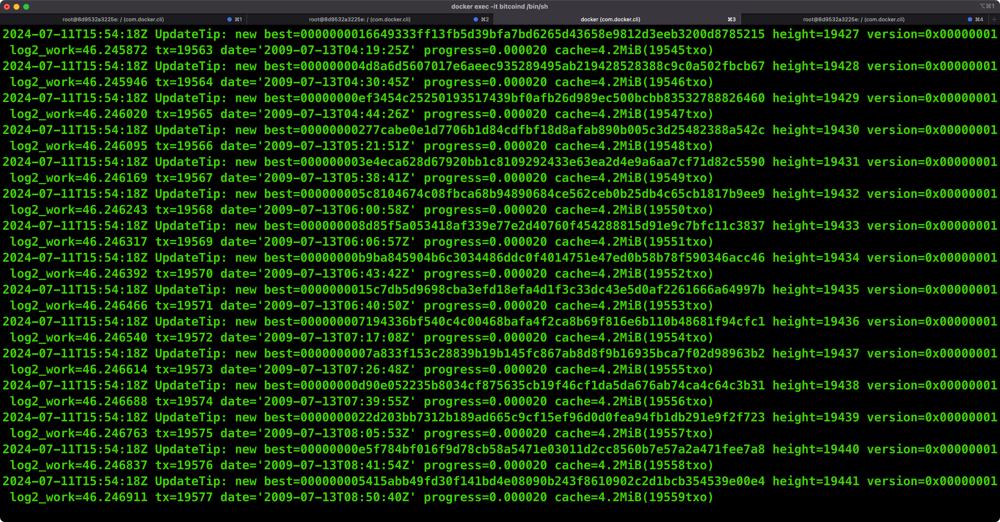

# 节点搭建

## 比特币节点

通过 `docker` 运行比特币测试网节点

```bash
# 拉取镜像
docker pull lncm/bitcoind:v25.1

# 启动容器, 数据保存在本地(非容器)目录下: $HOME/.bitcoin:/data/.bitcoin
# 同时会启动 bitcoind 服务, 且网络是 regtest
docker run -d \
    --name bitcoind_regtest \
    -p 18443:18443 \
    -p 18444:18444 \
    -p 28333:28333 \
    -p 28332:28332 \
    -v $HOME/.bitcoin:/data/.bitcoin \
    lncm/bitcoind:v25.1 \
    -chain=regtest \
    -txindex=1 \
    -fallbackfee=0.00001 \
    -zmqpubrawblock=tcp://0.0.0.0:28332 \
    -zmqpubrawtx=tcp://0.0.0.0:28333 \
    -rpcallowip=0.0.0.0/0 \
    -rpcbind=0.0.0.0 \
    -rpcauth='roochuser:925300af2deda1996d8ff66f2a69dc84$681057d8bdccae2d119411befa9a5f949eff770933fc377816348024d25a2402'

# 在容器外创建命令行 bitcoin-cli 别名
# 下面执行 bitcoin-cli 时实际是在容器内之前 bitcoin-cli -regtest
# regtest 是回归测试网, 一个完全空白的比特币网络
alias bitcoin-cli="docker exec -it bitcoind_regtest bitcoin-cli -regtest"

# 创建钱包
bitcoin-cli createwallet <your wallet name>

# 生成新的一个钱包地址
bitcoin-cli getnewaddress

# 获取已生成的地址列表
bitcoin-cli listreceivedbyaddress 0 true

# 获取节点信息
bitcoin-cli -getinfo

# 生成 101 个区块并获得 50btc 奖励
bitcoin-cli generatetoaddress 101 <your wallet address>

# 获取余额
bitcoin-cli getbalance  # 50.00000000

# 获取区块高度
bitcoin-cli getblockcount  # 101
```

如果你想启动主网全节点服务，可以运行下面的命令:

```bash
# 进入容器内部
docker exec -it bitcoind_regtest /bin/sh

# (主网)容器内部启动 bitcoin-core 服务, 并开始同步节点
# 主网的默认端口是8332
bitcoind
# or: (主网)后台启动
bitcoind -daemon
# or: (主网)后台启动且不自动同步节点
bitcoind -daemon -connect=0

# 容器外查看主网已同步的区块高度
docker exec -it bitcoind_regtest bitcoin-cli getblockcount
```



## rooch 节点

通过 `docker` 运行 `rooch` 节点

```bash
# 拉取镜像
docker pull ubuntu

# 启动容器
docker run --itd --name rooch ubuntu

# 进入容器内部
docker exec -it rooch /bin/bash

# 更新并安装系统依赖
apt update
apt install git curl cmake gcc lld pkg-config libssl-dev libclang-dev libsqlite3-dev g++ protobuf-compiler

# 安装 rust, 出现选项时, 选择 1 即可
curl --proto '=https' --tlsv1.2 -sSf https://sh.rustup.rs | sh

# 创建目录存放 rooch 源码
mkdir /code

# 下载 rooch 源码
cd /code && git clone https://github.com/rooch-network/rooch.git

# 编译源码
cd rooch && cargo build && cp target/debug/rooch ~/.cargo/bin

# rooch 初始化
rooch init
```

接下来启动的 `rooch` 服务依赖于 `bitcoin` 节点， 而 `bitcoin` 节点服务 和 `rooch` 分别独立于两个 `docker` 环境, 可以通过 `docker` 的虚拟 `ip` 来实现通信

```bash
# 进入 bitcoin 容器内部
docker exec -it bitcoind_regtest /bin/sh

# 获取 ip
ifconfig
```

可以得到下面的输出

```bash
eth0      Link encap:Ethernet  HWaddr 02:42:AC:11:00:03
          inet addr:172.17.0.3  Bcast:172.17.255.255  Mask:255.255.0.0
          UP BROADCAST RUNNING MULTICAST  MTU:65535  Metric:1
          RX packets:17 errors:0 dropped:0 overruns:0 frame:0
          TX packets:3 errors:0 dropped:0 overruns:0 carrier:0
          collisions:0 txqueuelen:0
          RX bytes:1248 (1.2 KiB)  TX bytes:164 (164.0 B)
```

`172.17.0.3` 是 `bitcoin` 容器的 ip

启动 `rooch` 服务

```bash
# 进入 rooch 容器内部
docker exec -it rooch /bin/bash

# 启动服务
rooch server start --btc-rpc-url http://172.17.0.3:18443 --btc-rpc-username roochuser --btc-rpc-password roochpass
```

在启动服务后, 可以看到控制台一直在输出 `BitcoinRelayer` 相关的信息

```
2024-07-11T17:58:01.657691Z  INFO rooch_relayer::actor::bitcoin_relayer: BitcoinRelayer process block, height: 101, hash: 2a1e73d4d6e7684265774258200cb6ed3a74f71c9aedb4a2f2fe0d5c84bb41c3, tx_size: 1, time: 1720719741
2024-07-11T17:58:01.659500Z  INFO rooch_sequencer::actor::sequencer: sequencer tx: 0x413c…14cb order: 203
2024-07-11T17:58:01.665262Z  INFO rooch_relayer::actor::relayer: Relayer execute relay block(hash: c341bb845c0dfef2a2b4ed9a1cf7743aedb60c20584277654268e7d6d4731e2a, height: 101) success
2024-07-11T17:58:01.672861Z  INFO rooch_sequencer::actor::sequencer: sequencer tx: 0x82b0…8dbd order: 204
2024-07-11T17:58:01.696097Z  INFO rooch_relayer::actor::relayer: Relayer execute relay tx(txid: 7fedd2ab8c7af24b41f6f7995a4558c2d0b9025fc0f734ed176b7855fed14c36) success
2024-07-11T17:58:06.652612Z  INFO rooch_proposer::actor::proposer: [ProposeBlock] block_number: 3, batch_size: 3
```

并且只到 `height: 101`, 这是因为我们之前生成了 101 个区块

保留 `rooch` 服务命令行窗口, 新建一个窗口, 输入下面的命令来生成 1 个新的区块

```bash
docker exec -it bitcoind_regtest bitcoin-cli -regtest generatetoaddress 1 <your wallet address>
```

等待一会后, 可以看到 `rooch` 服务命令行窗口打印出了最新的区块

```bash
2024-07-11T18:05:03.841785Z  INFO rooch_relayer::actor::bitcoin_relayer: BitcoinRelayer process block, height: 102, hash: 350f438fea197268facf3fc62224c3968e18c7977f65dacb15525e43855ffbf5, tx_size: 1, time: 1720721059
2024-07-11T18:05:03.845564Z  INFO rooch_sequencer::actor::sequencer: sequencer tx: 0xed4e…028c order: 205
2024-07-11T18:05:03.856074Z  INFO rooch_relayer::actor::relayer: Relayer execute relay block(hash: f5fb5f85435e5215cbda657f97c7188e96c32422c63fcffa687219ea8f430f35, height: 102) success
2024-07-11T18:05:03.866893Z  INFO rooch_sequencer::actor::sequencer: sequencer tx: 0x85ef…94e5 order: 206
2024-07-11T18:05:03.894587Z  INFO rooch_relayer::actor::relayer: Relayer execute relay tx(txid: 485ac7d9bf41fbe469790b18c3990cc29cceebec197401c3b5393c27d0019d2b) success
2024-07-11T18:05:06.997012Z  INFO rooch_proposer::actor::proposer: [ProposeBlock] block_number: 4, batch_size: 2
```

调用 `rooch rpc` 接口

```bash
# 先按住 ctrl + z 将正在运行的进程转到后台
# 查看后台运行的所有的任务
jobs
# 找到 rooch 服务所在的序号, 转到后台运行
bg 1

# 调用 rooch rpc 服务
rooch rpc request --method rooch_queryObjectStates --params '[{"object_type":"0x4::utxo::UTXO"},  null, "2", {"descending": true,"showDisplay":false}]'

rooch rpc request --method rooch_queryObjectStates --params '[{"object_type":"0x4::ord::Inscription"},  null, "2", {"descending": true,"showDisplay":false}]'
```

参考资料:

- [lncm/bitcoind](https://github.com/lncm/docker-bitcoind)
- [bitcoin-cli](https://chainquery.com/bitcoin-cli)
