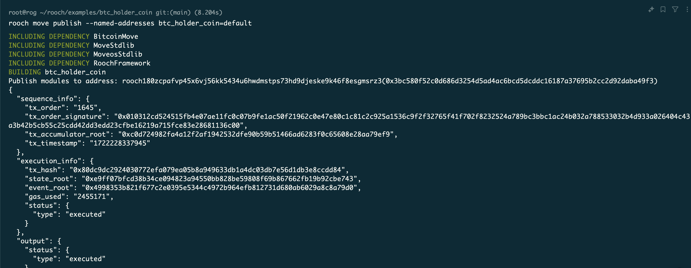
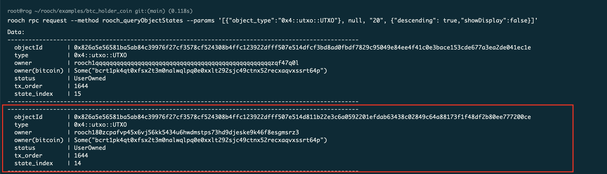
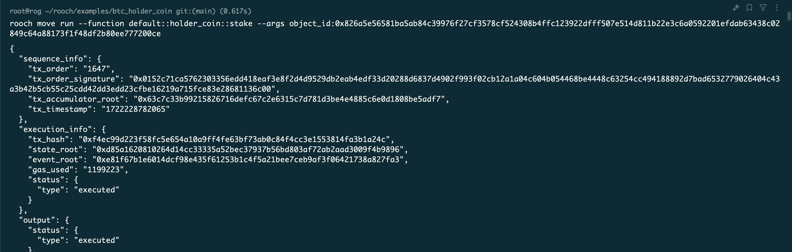
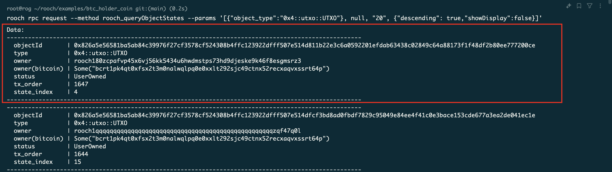
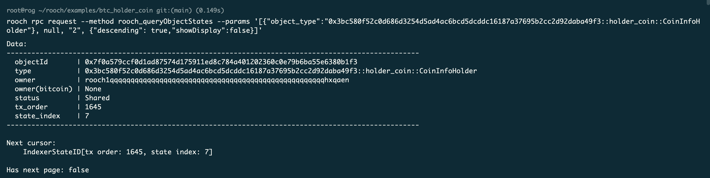
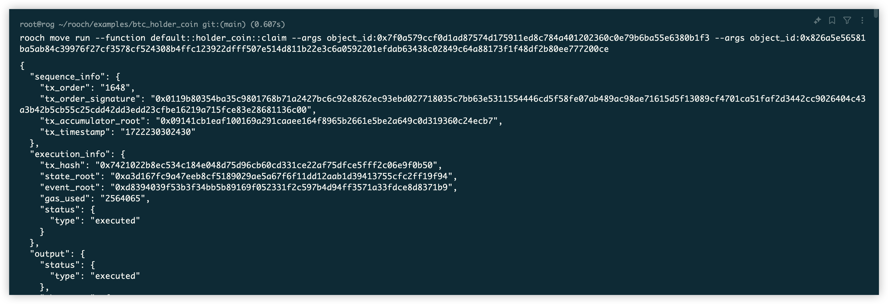
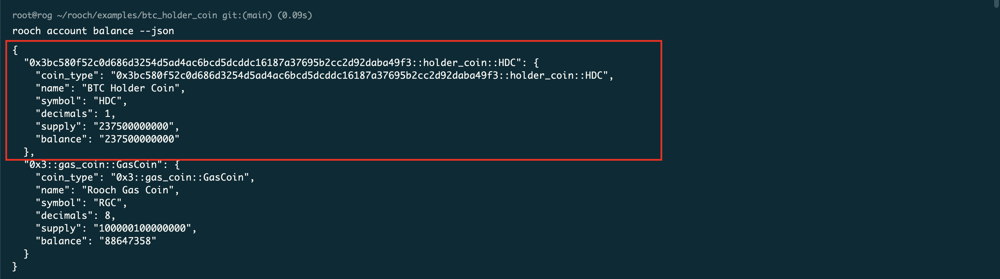

# 学习成果

## Week1

## Week2

## Week3
Using https://github.com/rooch-network/rooch/blob/main/examples/btc_holder_coin/sources/holder_coin.move as a example:

1. Deploy the holder_coin contract

2. Check the UTXO objects

3. Perform stake

4. Check the UTXO objects change

5. Get `CoinInfoHolder` object

6. Perform claim

7. Check HDC balance

