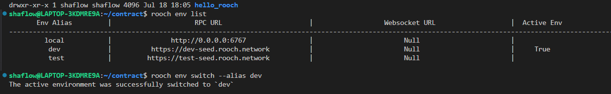
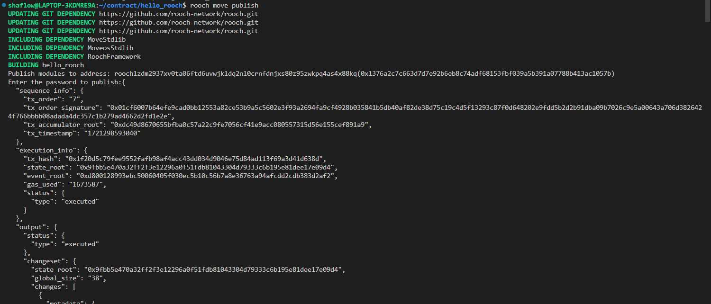

# 学习日志

## 第二课作业

### 一、从二进制安装rooch
1. 获取压缩包
```
wget https://github.com/rooch-network/rooch/releases/latest/download/rooch-ubuntu-latest.zip
```
2. 解压缩
```
unzip rooch-ubuntu-latest.zip
```
3. 环境
```
sudo cp rooch /usr/local/bin
```

### 二、创建账户并且领取测试币
1. 初始化创建默认账户
```
rooch init
```
2. 尝试手动创建新账户
```
rooch account create
```
3. 显示账户列表
```
rooch account list
```
### 三、创建并发布Move package
1. 新建hello_rooch包
```
rooch move new hello_rooch
```
2. 添加hello_rooch合约
```move
module hello_rooch::hello_rooch {
    use moveos_std::account;
    use std::string;
    struct HelloMessage has key {
        text: string::String
    }
    entry fun say_hello(owner: &signer) {
        let hello = HelloMessage { text: string::utf8(b"Hello Rooch!") };
        account::move_resource_to(owner, hello);
    }
}
```
3. 显示网络配置
```
rooch env list
```
4. 切换至开发者网
```
rooch env switch --alias dev
```

5. 发布hello_rooch包
```
rooch move publish
```


## 第三课作业

设计一个游戏：  
# 黄金矿工
## 发现矿脉

*  玩家可以在比特币网络上铸造矿脉铭文，这些铭文代表了一个新的矿脉位置。
* 每个矿脉铭文具有独特的属性，例如矿石种类、储量和稀有度。
开采矿石

## 使用铸造的矿脉铭文，玩家可以在Rooch上启动矿石开采任务。
* 开采任务需要一定的时间和资源（如能源和工具）。
* 不同的矿脉铭文开采出的矿石数量和种类不同。
## 精炼矿石

* 玩家定期在Rooch Layer 2上对矿石进行精炼。
* 精炼需要一定的时间和资源（如燃料和化学品）。
* 精炼过程会有一定的成功率，并且可能会产生副产品。
## 交易金属

* 玩家可以将精炼后的金属交易。
* 交易可以获得游戏内货币，用于购买更多资源或矿脉铭文。
* 金属还可以用于制造高级物品，这些物品可以提升玩家的开采和精炼效率。
## 可能的扩展功能：
### 合作开采

* 玩家可以组建团队共同开采大型矿脉，提高效率和收益。
* 团队成员可以分工合作，例如有些人专门负责开采，有些人专门负责精炼。
* 矿石交易所

* 建立一个去中心化的矿石交易所，允许玩家自由买卖矿石和金属。
* 交易所可以根据供需关系调整矿石和金属的价格。

