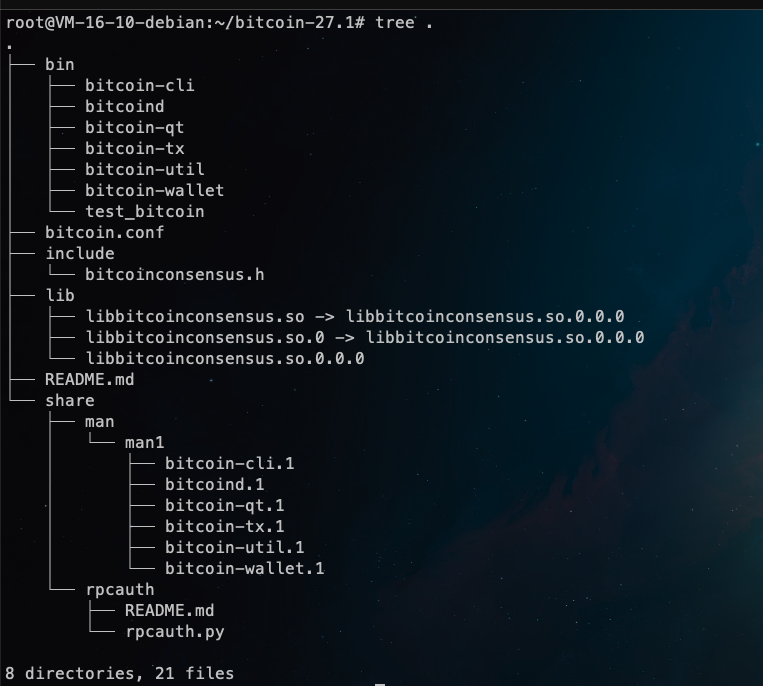
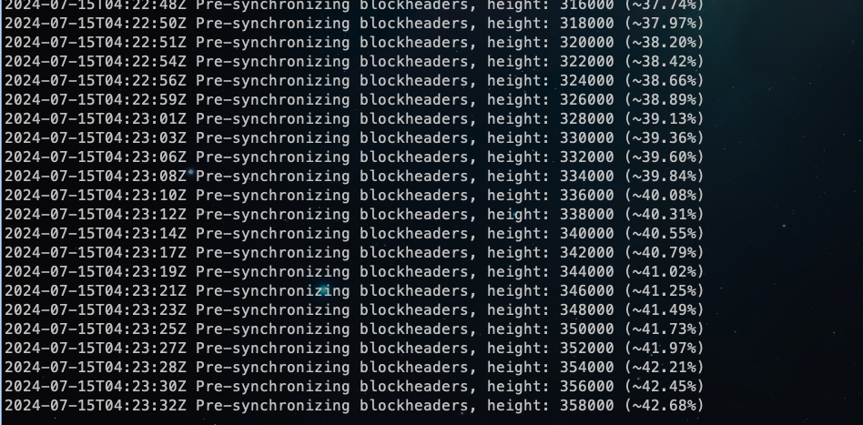
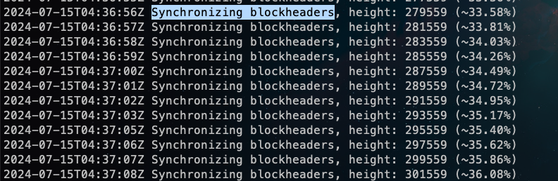
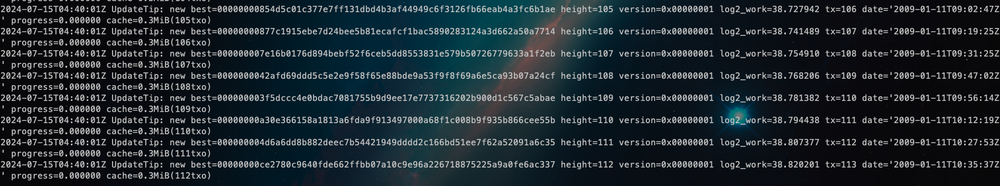
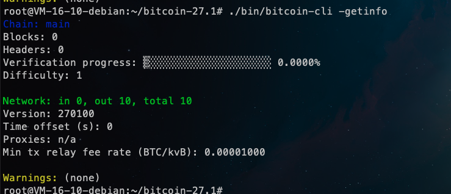
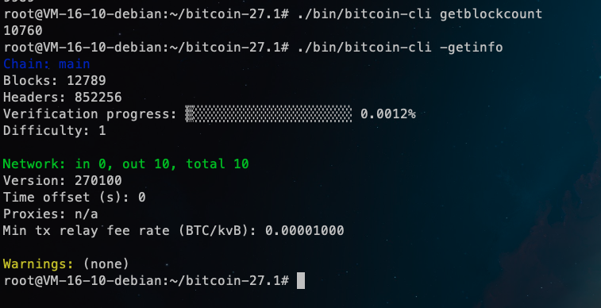
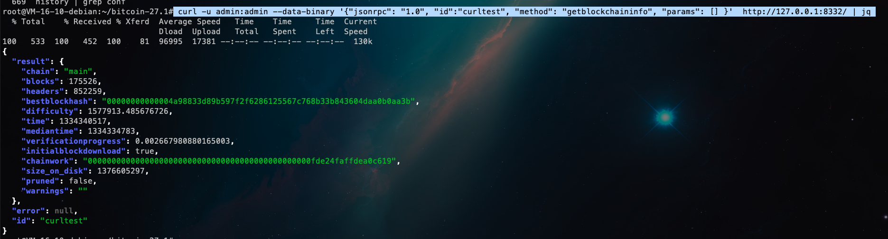

# 学习日志

## 搭建比特币节点

1. 下载程序

下载地址： [https://bitcoincore.org/en/download/](https://bitcoincore.org/en/download/)
根据你的操作系统选择对应的程序。

2. 运行 bitcoind 启动节点

下载解压，目录结构如下： 



3. 启动节点

```shell
./bin/bitcoind 
```

节点同步状态如下:

先经历一个比较漫长的 `Pre-synchronizing` 阶段


再经历一个比较漫长的 `Synchronizing blockheaders` 阶段


最后，开始同步区块



4. 查看节点信息

```shell
./bin/bitcoin-cli -getinfo
```



获取同步的区块高度

```shell
./bin/bitcoin-cli -getblockcount
```



5. 方便 rpc 请求，配置文件 `bitcoin.conf` 添加 rpc 授权信息

```conf
rpcuser=admin
rpcpassword=admin
```

启动的时候，使用全路径指定配置文件:

```shell
./bin/bitcoind -conf=/root/bitcoin-27.1/bitcoin.conf
```

curl 使用 rpc 调用，获取节点信息:

```shell
 curl -u admin:admin --data-binary '{"jsonrpc": "1.0", "id":"curltest", "method": "getblockchaininfo", "params": [] }'  http://127.0.0.1:8332/ | jq
```

