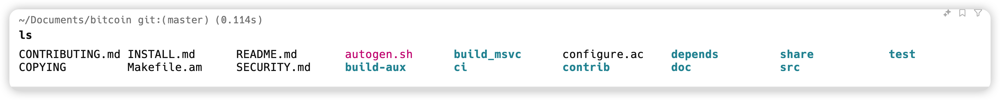
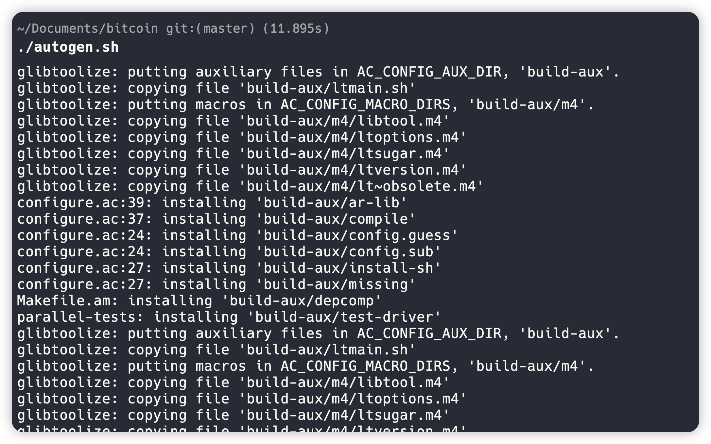
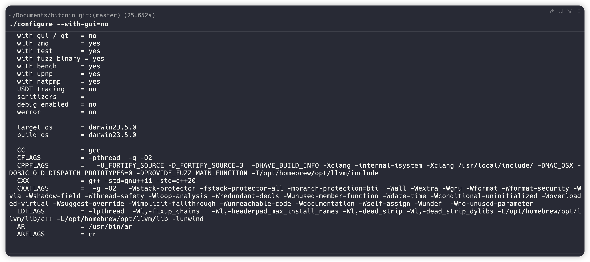
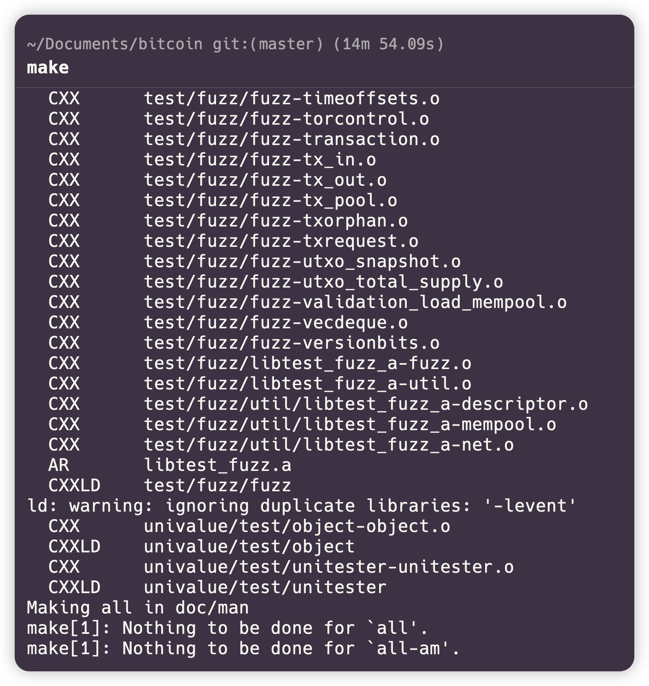
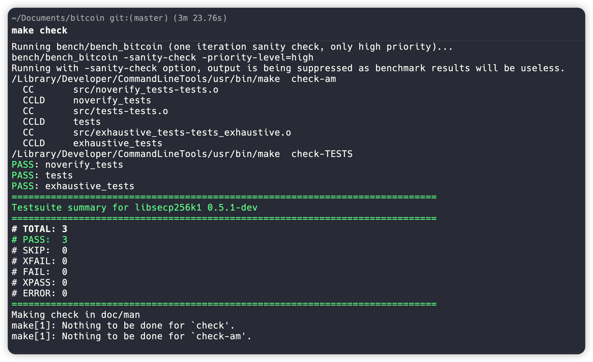
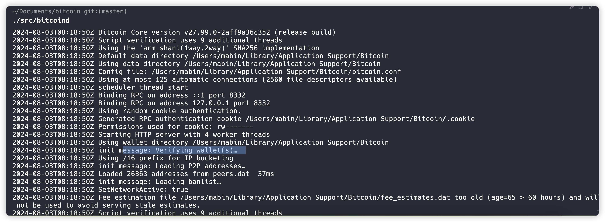
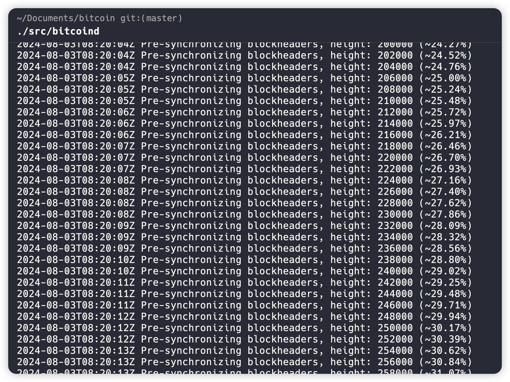
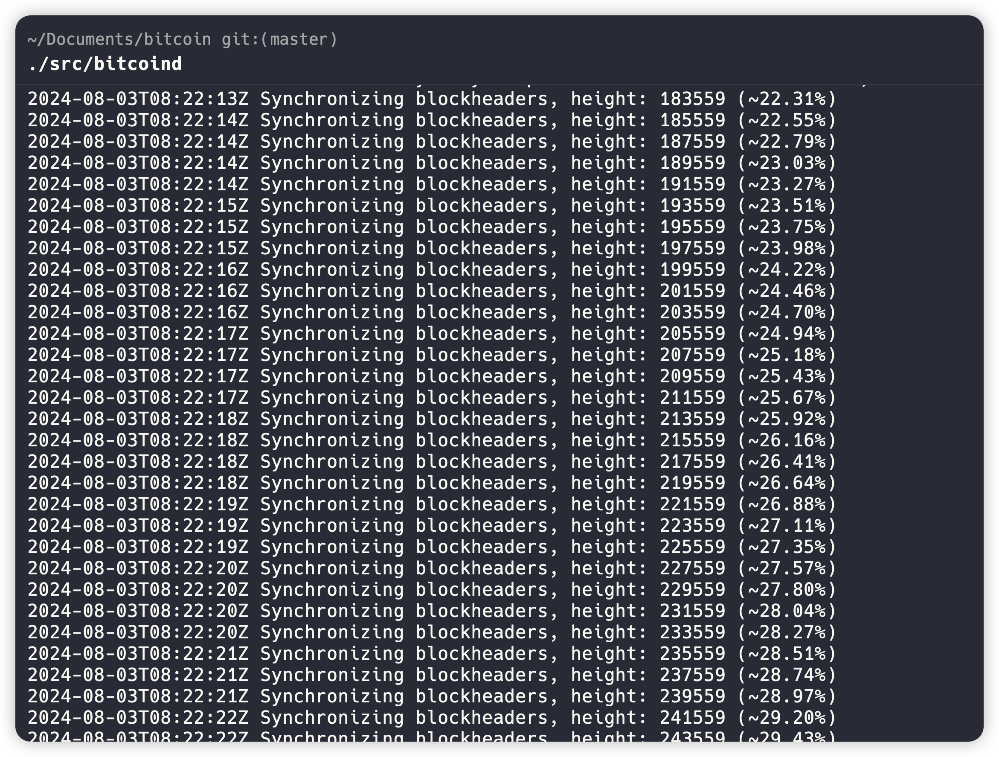
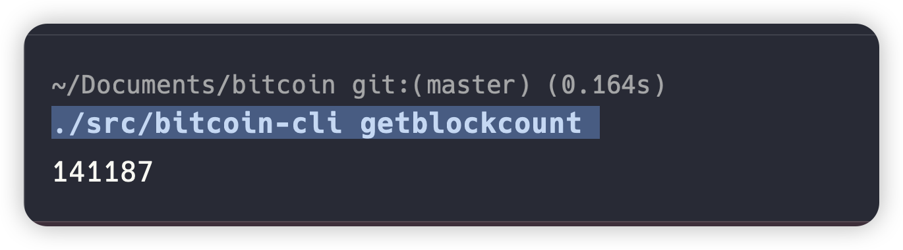

# 学习日志

## task1 搭建比特币节点

###  下载bitcoin code， 源码编译
    
   
   1. autogen
    
   2. configure 
    
   3. compile 
   
   
   
###  启动bitcoind 
   
   预同步阶段
   
   同步阶段
   

### 查看节点信息


### 获取区块高度

``` bash
    ./src/bitcoin-cli getblockcount 
```



