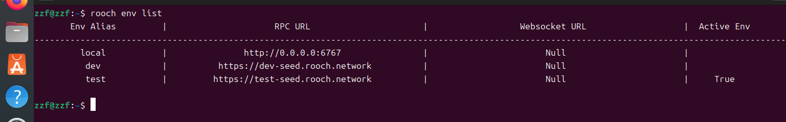

# 学习日志

Task1：搭建比特币节点
由于不是很懂加上有着优秀的pr，所以就想模仿着使用docker搭建比特币节点

Task2:在rooch部署的第一个合约
前期环境工作搞了很久，我的是windows电脑但rooch的环境在windows上有问题，于是就不了了之了，后面尝试Ubuntu虚拟机ubuntu-20.04.6-desktop-amd64老是编译有问题，后使用ubuntu-24.04-desktop-amd64终于成功的把rooch环境搭建好了，闲话就不多说了，下面是rooch搭建经验：

### 一.安装rooch并配置环境

安装依赖

```
sudo apt install git curl cmake make gcc lld pkg-config libssl-dev libclang-dev libsqlite3-dev g++ protobuf-compiler
```

安装 Rust

```
curl --proto '=https' --tlsv1.2 -sSf https://sh.rustup.rs | sh
```

克隆源码

```
git clone https://github.com/rooch-network/rooch.git
```

编译并安装 Rooch

```
cd rooch && cargo build && cp target/debug/rooch ~/.cargo/bin/
```

### 二.初始化rooch,获得rooch的地址和与之关联的btc地址：

```
rooch init
```

### 三.连接测试网络:

激活 test 网络：

```
rooch env switch --alias test
```

检查是否已经切换到正确的 test 网络：

```
rooch env list
```


### 四.领取Rooch Gas:
我们可以通过 Rooch Discord 的 Faucet 频道领取 Rooch Gas Coin。
```
Rooch 的 Discord 地址：https://discord.gg/rooch
```
具体可以参考我们的rooch学习大本营：
```
https://rooch.network/zh-CN/build/getting-started/get-gas-coin
```
### 五.创建合约:
1.创建第一个项目
```
rooch move new hello_rooch
```
2.在创建的source目录下添加 move 代码：
```
module hello_rooch::hello_rooch {
    use moveos_std::account;
    use std::string;
    struct HelloMessage has key {
        text: string::String
    }
    entry fun say_hello(owner: &signer) {
        let hello = HelloMessage { text: string::utf8(b"Hello Rooch!") };
        account::move_resource_to(owner, hello);
    }
}
```
### 六.部署合约
温馨提示：部署合约需要gas费，具体情况领取请看四.领取Rooch Gas。
```
rooch move publish
```


